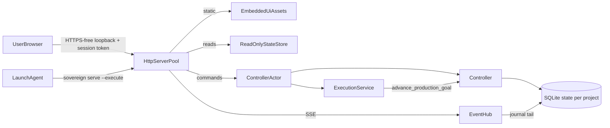
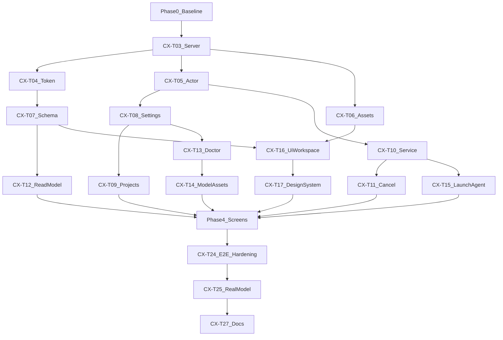

# Sovereign Consumer Product Plan

## 0. Ground truth the executor must know first

Read these before touching code, in this order:

1. [AGENTS.md](AGENTS.md)
2. [docs/wiki/README.md](docs/wiki/README.md)
3. [docs/wiki/20-agent-playbook.md](docs/wiki/20-agent-playbook.md)
4. [docs/wiki/14-cli-runner-control-api.md](docs/wiki/14-cli-runner-control-api.md)
5. [docs/wiki/08-security-and-permissions.md](docs/wiki/08-security-and-permissions.md)
6. [docs/wiki/12-model-and-resources.md](docs/wiki/12-model-and-resources.md)

The baseline is HEAD `d266399` plus 34 uncommitted files. On 2026-09-25, `./scripts/verify.sh` failed two tests (Phase 0 below).

What exists today (verified):

- Binary `sovereign` ([apps/sovereign/src/main.rs](apps/sovereign/src/main.rs)) with commands `goal`, `status`, `pause`, `resume`, `approvals`, `approval`, `serve`, `run [--once]`, `doctor`, and `eval`.
- `sovereign serve` ([apps/sovereign/src/control_api.rs](apps/sovereign/src/control_api.rs)):
  - a single-threaded, blocking `std::net` server;
  - loopback bind plus Host/Origin checks, no token;
  - routes `GET /`, `GET /dashboard`, `GET /v1/status`, `POST /v1/goals`, `POST /v1/control/pause`, `POST /v1/control/resume`, `POST /v1/approvals/respond`;
  - an inline `DASHBOARD_HTML` that renders raw JSON with `<pre>`.
- `serve` never executes goals. Execution only happens through `sovereign run` ([apps/sovereign/src/runner.rs](apps/sovereign/src/runner.rs)):
  - it resolves the git root of the current directory and holds `RunLock`;
  - it loops `advance_with_overrides` up to `MAX_ADVANCES` (64);
  - model settings come from the `SOVEREIGN_MODEL_*` environment variables.
- The read model is `LocalControl::read_model` in [crates/sovereign-controller/src/local_control.rs](crates/sovereign-controller/src/local_control.rs). It returns `ControllerStatusView`, plan revisions, verifications, approvals, and a recovery projection. There is no goal-level cancel, event stream, artifact or diff read, doctor JSON, settings, or project registry.
- Cancellation primitives exist: `CancellationTree`, `CancellationHandle::cancel`, `task_cancellation_handle`, and namespace `controller.cancellation_request`. None of them is exposed through `LocalControl`.

Invariants that no phase may weaken:

- The UI and API never write SQLite directly. Every mutation goes through a `LocalControl` or `Controller` method.
- Untrusted text is rendered as text only: repository content, model output, evidence, and memory.
- Loopback only. One resident model. `sandbox-exec` or deny. Unknown outcomes are never replayed. Plan revisions are immutable.
- Rust 1.89. `unsafe_code` forbidden. Clippy pedantic denied. No `unwrap` or `expect`.
- Frozen files under `output/` and `schemas/plan-ir-v1.json` are not edited. New scope enters through a new amendment file (task CX-T00).
- Do not revert or commit the user's existing uncommitted work unless the user says so. Commits happen only when the user authorizes them.

Environment notes for the executor:

- Run cargo with `PATH="$HOME/.rustup/toolchains/1.89.0-aarch64-apple-darwin/bin:$PATH"`.
- Tests that use `sandbox-exec` must run outside the Cursor sandbox (request `all` permissions).
- Node 22 is installed. The UI build is a dev-time step only. The shipped binary must build and run offline with no Node.

## Target architecture

Design decisions:

- **Single writer.** One `ControllerActor` thread per process owns the mutable `Controller` and the `RunLock` for the active project. HTTP handlers send typed commands over `std::sync::mpsc` and wait for a reply with a timeout. Reads open read-only `StateStore` handles, which WAL allows concurrently.
- **Execution service.** `sovereign serve --execute` runs the same production advance loop as `run`, one step at a time, inside the actor. It idles when there is no runnable goal, respects `ExecutionControlV1.paused`, and shows `DeferredResource` and pressure waits as statuses.
- **No new async runtime.** Keep std threads: a bounded worker pool of 4 plus at most 4 SSE clients. The workspace does not depend on tokio, and this phase should not add it.
- **App data.** Store config under `~/Library/Application Support/Sovereign/`:
  - `settings-v1.json`, `projects-v1.json`, `service-token` (mode 0600);
  - `projects/<project_id>/state.sqlite3` and `projects/<project_id>/cas/`.

  Controller state then lives outside user repositories. An existing `<repo>/.sovereign/state.sqlite3` can be adopted by reference. Environment variables still override everything. Config files are not execution authority.
- **UI.** React 19 + TypeScript (strict), Vite, Tailwind CSS v4 with design tokens, Radix UI primitives (accessibility), TanStack Query, React Router, `@xyflow/react` for the plan graph, and `lucide-react` icons.
- **Embedding.** Build output goes to `apps/sovereign/ui-dist/` and is committed. `apps/sovereign/build.rs` embeds it with `include_bytes!` into a generated asset table with SHA-256 ETags. A freshness check rebuilds and diffs it.
- **API contract.** A new frozen-by-amendment schema `schemas/control-api-v2.json` (JSON Schema). Rust tests validate every response against it (the `jsonschema` crate is already a workspace dependency). TypeScript types are generated from it with `json-schema-to-typescript`, and the generated file is committed and diff-checked.

## Phase 0: Stabilize the baseline

- **CX-T00, amendment and task ids.** Draft `output/CONSUMER_UX_AMENDMENT_v1.0.md`, modeled on [output/PRODUCT_DELIVERY_TASK_ID_AMENDMENT_v1.2.md](output/PRODUCT_DELIVERY_TASK_ID_AMENDMENT_v1.2.md). It defines profile `local_consumer_v1`, tasks CX-T01 through CX-T24 with dependencies, and states that the amendment adds no execution authority. The user must approve it before Phase 1. Do not edit `BUILD_STATE.json` until a task closes.
- **CX-T01, fix the broker test.** `postgres_broker::tests::broker_pins_upstream_identity_rejects_startup_and_never_replays_after_loss` fails at [crates/sovereign-controller/src/postgres_broker.rs](crates/sovereign-controller/src/postgres_broker.rs) line 779 (`TcpStream::connect(...).is_err()` after `broker.stop()`).
  - Hypothesis: a parallel test reuses the ephemeral port, or `stop()` returns before the listener fd closes.
  - Diagnose by running `cargo test -p sovereign-controller --lib broker_pins -- --test-threads=1` 20 times, then with default threads.
  - If it is port reuse, change the assertion so it proves this broker's listener is closed (for example, a broker-owned state flag plus refused accept on the same socket handle) instead of probing a reusable port.
  - If `stop()` returns early, make `stop()` join the accept thread and drop the listener before returning.
  - Acceptance: 20/20 passes under the default thread count.
- **CX-T02, fix the cancellation test.** `controller_inflight_model_cancellation_interrupts_backend_and_keeps_call_consumed` fails at [crates/sovereign-controller/tests/m6_t06_resilience.rs](crates/sovereign-controller/tests/m6_t06_resilience.rs) line 1000 ("Controller never entered model completion" within 1 s).
  - Hypothesis: the uncommitted pre-model admission (`admit_before_model_boundary` and frozen launch headroom) samples real host pressure and waits.
  - Confirm by logging the admission decision in a scratch run (do not commit the logging).
  - Fix by giving the fixture a green `ResourcePressureProbe` (the pattern `FixedFixturePressure` in `runner.rs`), or by making the admission wait honor the task cancellation handle. Do not lower `HardwareProfileV1::m1_8gb`.
  - Acceptance: 20/20 passes, and `compiler_model_boundary_is_not_reached_without_frozen_headroom` still passes.
- **Gate.** `./scripts/verify.sh` is fully green. Record the result in [docs/wiki/15-testing-and-evals.md](docs/wiki/15-testing-and-evals.md) and [docs/wiki/18-status-blockers-debt.md](docs/wiki/18-status-blockers-debt.md). Then ask the user whether to commit the existing uncommitted work before Phase 1.

## Phase 1: Service foundation (Rust)

- **CX-T03, threaded HTTP server.** Refactor `control_api.rs` into a module directory `apps/sovereign/src/control_api/` with `parse.rs`, `server.rs`, `routes.rs`, `static_assets.rs`, and `sse.rs`.
  - Keep every existing parser bound and error.
  - Bounded pool of 4 workers, 16 KiB headers, 64 KiB body, 10 s read timeout, 30 s idle close.
  - `Content-Type: application/json; charset=utf-8`.
  - Tests: all existing `apps/sovereign` control tests pass unchanged. A new concurrency test sends 50 parallel `GET /v1/status` with no deadlock. An oversized body returns 413. A slow client does not block other workers.
- **CX-T04, session token and browser hardening.**
  - Generate a 32-byte token from `/dev/urandom` at serve start and write it to `service-token` (0600, atomic write).
  - `GET /` accepts `?t=<token>` once. It sets the cookie `sovereign_session` (`HttpOnly`, `SameSite=Strict`, `Path=/`) and redirects to `/`.
  - Every `/v2/*` request needs the cookie, and state-changing requests also need header `X-Sovereign-CSRF` equal to a per-session value from `GET /v2/session`.
  - Headers on every response:
    - `Content-Security-Policy: default-src 'self'; script-src 'self'; style-src 'self'; img-src 'self' data:; connect-src 'self'; frame-ancestors 'none'; base-uri 'none'; form-action 'self'`
    - `X-Content-Type-Options: nosniff`
    - `Referrer-Policy: no-referrer`
    - `Cache-Control: no-store` for API responses
  - Keep the Host/Origin loopback checks.
  - The `/v1/*` routes stay for CLI compatibility and existing tests, with the same checks as today. Add the token requirement to `/v1` POSTs only behind the flag `--require-token`, which becomes the default in Phase 5 after the CLI has migrated.
  - Tests: missing cookie returns 401; wrong CSRF returns 403; a DNS-rebinding Host returns 400; a cross-origin Origin returns 400; the token file has mode 0600; the token never appears in logs or the read model.
- **CX-T05, ControllerActor.** New `apps/sovereign/src/actor.rs`.
  - The command enum covers `SubmitGoal`, `Pause`, `Resume`, `RespondToApproval`, `CancelGoal`, `SwitchProject`, and `Shutdown`, each with a typed reply.
  - It owns `LocalControl` or `Controller` plus `RunLock`.
  - HTTP handlers use `send` plus `recv_timeout(5s)` and return 503 on timeout.
  - Tests: commands are serialized; the actor survives handler panics; shutdown releases `RunLock` (a second process can then acquire it).
- **CX-T06, embedded static assets.** Add `apps/sovereign/build.rs`, which walks `ui-dist/` and generates `OUT_DIR/assets.rs` with path, bytes, MIME type, and SHA-256.
  - Serve with `ETag` and `If-None-Match`. SPA fallback serves `index.html` for non-API GETs.
  - If `ui-dist/` is missing, the build embeds a minimal page saying the UI was not built. The build never fails.
  - Remove `DASHBOARD_HTML` once the new UI covers every current feature (Phase 4 gate).
  - Tests: ETag round trip; path traversal (`/../`, encoded `%2e%2e`) returns 404; the MIME table is correct.
- **CX-T07, control API v2 schema.** Write `schemas/control-api-v2.json` covering every `/v2` request and response. Add `apps/sovereign/tests/control_api_contract.rs`, which validates live responses against it. This depends on CX-T00 approval, because it is a new frozen contract.

## Phase 2: Product services (Rust)

- **CX-T08, settings and app data.** New module `apps/sovereign/src/app_data.rs`.
  - `SettingsV1`: model runtime path, model path, model name, Chrome path, Node path, and `execute_on_start`.
  - `ProjectsV1`: a list of `{project_id, display_name, root, state_path, cas_root, created_at_ms}`.
  - Versioned, `deny_unknown_fields`, atomic temp-then-rename writes, 0600 files and 0700 directories.
  - Environment variables override settings. `runner.rs` reads settings when a variable is absent.
  - Paths are validated as absolute and canonical. A state path inside a registered repository root is rejected for new projects; adopted legacy paths are allowed.
  - Tests: round trip; unknown field rejected; symlinked config directory rejected; environment precedence.
- **CX-T09, project registry and repository selection.**
  - Endpoints: `GET /v2/projects`, `POST /v2/projects` with `{root, display_name}`, and `POST /v2/projects/{id}/activate`.
  - `root` must be an existing git work tree resolved with pinned `/usr/bin/git rev-parse --show-toplevel`.
  - Activation goes through the actor. It drains the execution service at a step boundary, releases the old `RunLock`, acquires the new one, and runs `Controller::reopen_local`.
  - Exactly one active project per process, matching the single mutating slot.
  - CLI: `sovereign project add|list|use`.
  - Tests: a non-git path is rejected; switching while a task runs waits for the step boundary; two projects keep isolated state; a relaunch restores the last active project.
- **CX-T10, execution service.** Extract the loop body of `run_at_with_project_config_and_overrides` into a reusable `ExecutionService::step()` that returns `ProductionAdvanceOutcome`. `run` keeps its CLI behavior on top of it.
  - `serve --execute` runs `step()` in the actor between commands.
  - Backoff: none after progress outcomes. 1 s, then 2 s, capped at 10 s, while idle, paused, blocked, or deferred.
  - Any error is surfaced as a service status. It never retries an unknown outcome.
  - Status struct `ServiceStatusV1`: `idle | running | paused | waiting_for_approval | deferred_resource | recovery_blocked | error`, with detail, `last_outcome`, and `last_step_at_ms`.
  - Tests:
    - A queued goal submitted over HTTP compiles, executes, and completes with `DeterministicFakeBackend` through the service with no CLI.
    - Pause stops at a step boundary.
    - Killing the serve process mid-task, then restarting it, recovers through `RecoveryManager` with no replay. Reuse the kill harness pattern from `crates/sovereign-eval/tests/crash_resume.rs`.
    - `run` and `serve --execute` on the same state contend on `RunLock`.
- **CX-T11, goal cancellation.**
  - Trace the existing `controller.cancellation_request` writer and `CancellationTree`.
  - Add `LocalControl::request_goal_cancellation(goal_id, principal)` that delegates to a Controller method. It records a durable, CAS-guarded request plus a journal event, and the production driver honors it at the next boundary. An in-flight model call is interrupted through the existing task cancellation handle.
  - A cancelled goal ends in a terminal cancelled status. Dispatched side effects still go through unknown or reconciliation, never an assumed rollback.
  - `POST /v2/goals/{id}/cancel`, plus CLI `sovereign cancel <goal_id>`.
  - Tests: cancel while queued, while compiling, during model dispatch, and after dispatch. In the last case the action becomes `unknown` and the task becomes `ReconcilingUnknown`.
- **CX-T12, read model enrichment.** All endpoints are read-only and bounded.
  - `GET /v2/overview`: service status, active project, pause state, a model residency summary from `controller.resource_residency`, the pressure band, and counts.
  - `GET /v2/goals` (paginated) and `GET /v2/goals/{id}`: intent, plan revisions, a task DAG with dependencies and `TaskState`, attempts, verification results, the completion record, and failure records.
  - `GET /v2/events?after={sequence}&limit<=200`: a projection of `event_journal` with only whitelisted entity types and kinds and redacted payload summaries.
  - `GET /v2/events/stream`: SSE that tails the journal every 500 ms and sends `id: sequence` so `Last-Event-ID` resume works. At most 4 clients, with 15 s heartbeats.
  - `GET /v2/artifacts/{digest}?offset&length<=256KiB`: reads only from `ArtifactStore`, which already holds redacted bytes. Text only: bytes that are not UTF-8 return metadata, not content.
  - `GET /v2/tasks/{key}/diff`: the unified diff from the recorded changeset or diff artifact, capped at 512 KiB.
  - `GET /v2/approvals/{id}`: the exact bound payload preview, capability, risk class, expiry, and epoch.
  - `GET /v2/recovery`: the `LocalControlRecoveryProjection` plus plain-language explanations produced by a pure Rust function with unit tests.
  - Tests: schema validation (CX-T07); pagination bounds; a digest not referenced by the active project returns 404; a secret-shaped string planted in a fixture artifact is redacted in the API output; journal payloads never leak raw `value_json` fields outside the whitelist.
- **CX-T13, doctor and onboarding API.** `GET /v2/doctor` returns a structured check list. Each check has `{id, status: pass|warn|fail, detail, fix_hint}`:
  - `sandbox-exec` present, and the `MacSandboxExecBackend::detect()` self-test passes;
  - `/usr/bin/git` and `/usr/bin/python3`;
  - the model runtime is executable, and the GGUF exists with its SHA-256 matching the manifest;
  - free disk space is at least `minimum_host_free_disk_mib`;
  - physical memory meets the `m1_8gb` profile;
  - Chrome and Node (optional, warn only);
  - app data directory permissions;
  - the state schema version is 7.

  CLI `sovereign doctor --json` returns the same data. Tests cover each check with fixtures (fake paths, wrong digest).
- **CX-T14, model assets.** Add `apps/sovereign/assets/model-manifest-v1.json` (versioned, committed). It lists the exact Qwen3-4B-Q4_K_M GGUF and llama.cpp `b10516` archive with URLs, byte sizes, and SHA-256. Compute the SHA-256 from the local files in `.models/` and `.tools/` and record the upstream URL; if the upstream URL cannot be confirmed, leave download disabled and support "choose existing file" only.
  - `POST /v2/setup/model/verify` with `{runtime_path, model_path}` hashes the files with bounded streaming, checks the manifest, and saves them to settings.
  - Optional `POST /v2/setup/model/download` works only with an explicit user confirmation token in the request, returned by a preceding `GET` that shows URL, size, and destination.
    - It runs pinned `/usr/bin/curl` through `ProcessRunner` with `MacSandboxExecBackend`, a network grant limited to the manifest host, a write grant limited to the app data `models/` directory, and output caps.
    - It verifies the SHA-256 before an atomic rename, and progress streams over SSE.
    - This is setup-time network and does not change runtime offline behavior.
  - Tests: a digest mismatch deletes the partial file and fails; a URL outside the manifest is rejected; a download without the confirmation token is rejected; running offline returns a clear error.
- **CX-T15, LaunchAgent.** `sovereign service install|uninstall|status`.
  - Writes `~/Library/LaunchAgents/dev.sovereign.agent.plist` with `ProgramArguments [<canonical sovereign path>, "serve", "--execute", "127.0.0.1:7777"]`, `RunAtLoad`, `KeepAlive` on crash only, and stdout and stderr logs under app data `logs/` with 10 MiB rotation done by sovereign.
  - Uses `launchctl bootstrap|bootout gui/<uid>` through `/bin/launchctl`.
  - `sovereign app` starts the agent if it is not running, reads `service-token`, and opens `http://127.0.0.1:7777/?t=<token>` with `/usr/bin/open`.
  - Tests: plist content snapshot; install is idempotent; uninstall removes both the job and the file; `app` with no service prints actionable guidance. Launchctl calls go through an injectable trait in tests.

## Phase 3: UI foundation

- **CX-T16, UI workspace.** Create `apps/sovereign/ui/` with `package.json`, `package-lock.json`, `tsconfig.json` (strict, `noUncheckedIndexedAccess`), `vite.config.ts` (output `../ui-dist`, hashed filenames, no source maps in dist, and no external CDN, font, or telemetry), ESLint (typescript-eslint strict, jsx-a11y, react-hooks), and Prettier.
  - `src/api/generated.ts` is generated from `schemas/control-api-v2.json`.
  - `src/api/client.ts` is a typed fetch wrapper with the CSRF header, error normalization, and SSE with `Last-Event-ID` reconnect.
  - Scripts: `dev` (Vite proxy to `127.0.0.1:7777`), `build`, `typecheck`, `lint`, `test` (Vitest + jsdom), `gen:api`, `e2e`.
  - Add `scripts/verify-ui.sh`. It runs `npm ci`, gen:api with a diff check, typecheck, lint, test, and build, then `git diff --exit-code apps/sovereign/ui-dist apps/sovereign/ui/src/api/generated.ts`. `scripts/verify.sh` calls it when `node` exists, and prints a clear skip otherwise; CI-equivalent runs require Node.
- **CX-T17, design system.** Visual direction is a calm, precise control room: the product should read as trustworthy rather than flashy. Use the frontend design and accessibility skills when doing this task.
  - Tokens in `src/styles/tokens.css`:
    - color with semantic roles (surface, raised, border, text, muted, accent, success, warning, danger, info), light and dark schemes, and contrast of at least 4.5:1 for text;
    - a 4 px spacing scale; radii; elevation;
    - a system font stack plus a monospace stack;
    - a type scale from 12 to 32;
    - motion durations of 120, 180, and 240 ms with `prefers-reduced-motion` respected.
  - Components in `src/components/`, all keyboard-operable with visible focus: `AppShell` (sidebar, top bar, command palette with Cmd-K), `Button`, `IconButton`, `Badge`/`StatusPill` (mapped from `TaskState`, `ServiceStatus`, and approval status), `Card`, `EmptyState`, `Skeleton`, `Toast` (aria-live), `Dialog` and `ConfirmDialog` (Radix), `Tabs`, `Tooltip`, `CodeBlock`, `DiffViewer`, `KeyValue`, `Timeline`, and `ProgressRing`.
  - `CodeBlock` and `DiffViewer` build DOM text nodes and spans only. Syntax highlighting uses a small tokenizer that emits spans. `dangerouslySetInnerHTML` is banned by an ESLint rule. Markdown is not rendered from untrusted sources.
  - Tests: one Vitest render test per component, a `vitest-axe` check for each with no violations, and a keyboard navigation test for the dialog and command palette.

## Phase 4: Core experience

The route map is below. Every screen has loading, empty, error, and offline states. All data comes from TanStack Query plus SSE invalidation.

- **CX-T18, onboarding wizard** (`/welcome`, shown when settings or projects are empty or doctor has a failure).
  - Steps: 1. welcome and what Sovereign can do (honest scope); 2. system check from `/v2/doctor`, with fix hints and a re-run; 3. model setup (choose existing files, or confirm the optional download with progress); 4. choose a repository (path input plus validation; the browser cannot open a native picker, so show recent git roots detected from settings, and paste a path); 5. optional background service install, with explanation; 6. done, pointing to the first goal.
  - Tests: component tests per step; an E2E happy path; a doctor failure blocks the continue button with an accessible reason.
- **CX-T19, home and projects** (`/`, `/projects`).
  - Service status hero: running, paused, waiting for approval, deferred for memory (with the pressure band), recovery blocked.
  - Pause/resume toggle, active project switcher, recent goals, approvals badge, and model residency ("Model loaded" or "Model idle, unloads after 120 s").
- **CX-T20, goal composer and goal list** (`/goals`, `/goals/new`).
  - Multiline composer, a character limit that matches the server, a "what works well today" helper derived from compiler limits (bounded edits, file create or patch, governed build/test; up to 16 tasks), submit, and an optimistic queued card.
  - The list is filterable by status and paginated.
  - Tests: an over-length goal is rejected client-side and server-side; submission shows the queued state within one SSE tick.
- **CX-T21, goal detail** (`/goals/:id`).
  - Header with status, elapsed time, revision number, and cancel through `ConfirmDialog`.
  - Tabs:
    - **Plan**: an `@xyflow/react` DAG laid out left to right, nodes colored by `TaskState` with labels and icons (not color alone), and a revision switcher showing superseded tasks.
    - **Activity**: a live `Timeline` from SSE events, human-readable, with raw JSON behind a disclosure.
    - **Changes**: a per-task `DiffViewer`.
    - **Verification**: acceptance criteria, each with pass/fail and an evidence link.
    - **Evidence**: an artifact viewer with bounded paging.
    - **Attempts**: repair history with failure synopses.
  - Completion view: a summary of verified changes and the final checkpoint id, clearly stating that verification, not the model, decided completion.
  - Failure view: the terminal reason in plain language plus next steps (edit and resubmit the goal, check the recovery center).
  - Tests: DAG renders 16 nodes within the performance budget; the revision switch updates; the diff viewer escapes HTML in a fixture diff containing `<script>`.
- **CX-T22, approvals inbox and recovery center** (`/approvals`, `/recovery`).
  - Each approval card shows the exact action (executable and arguments, or file path and diff preview), the capability, a risk explanation, expiry countdown, epoch, and plan/task. Approve and Deny require an explicit click, and Approve requires typing or confirming in a dialog for the `destructive`, `external_side_effect`, and `secret_use` classes.
  - The principal defaults to the macOS user name plus `@ui` and is editable in settings.
  - There is no bulk approve, and an expired approval is disabled.
  - The recovery center lists unknown actions, unresolved rollbacks, conflicted worktrees, non-terminal process leases, and a plain-language explanation of why mutation is blocked, with only the Controller-supported next actions.
  - Tests: no auto-approve path exists (static test that the approve API is only called from the confirm handler); an expired approval cannot be clicked; the recovery explanation strings are covered.
- **CX-T23, settings, diagnostics, notifications** (`/settings`, `/diagnostics`).
  - Settings edits model paths (re-verified), Chrome and Node paths, the principal name, theme, and the background service.
  - Diagnostics shows doctor output, versions (binary, state schema 7, Plan IR 1.2, UI build hash), a log tail, and "copy diagnostics", redacted, with no token.
  - Browser notifications are opt-in through the Notification API for approval needed, goal completed, goal failed, and recovery blocked, fired from SSE while any tab is open. A foreground in-app toast always appears.
  - Remove the legacy `DASHBOARD_HTML` and point `/dashboard` to the SPA route. Update `dashboard_is_read_only_and_uses_only_local_control_routes` to assert the SPA only calls `/v2` endpoints listed in the schema, using a static scan of the built JS for route strings.

Phase 4 gate: every feature of the old dashboard (control, goals, plan, progress, verification and evidence, approvals, recovery) is present in the new UI and exercised by E2E.

## Phase 5: Quality, security, and performance

- **CX-T24, E2E and hardening.**
  - Add a non-default cargo feature `e2e-fixtures` on `apps/sovereign` that builds binary `sovereign-e2e-server`. It composes the real server and actor with `DeterministicFakeBackend` and a temporary fixture repository. It must not be reachable from the production binary; a test asserts the release binary has no `e2e` symbols or strings.
  - Playwright uses installed Chrome (`channel: 'chrome'`), so there is no browser download. Specs:
    1. onboarding with fixture assets;
    2. add project;
    3. submit goal, watch the plan, completion, and diff;
    4. a goal that needs approval: approve, then deny on a second run;
    5. pause and resume;
    6. cancel during execution;
    7. kill the server mid-task, restart it, and see recovery without replay;
    8. an evidence XSS fixture renders inert;
    9. a request missing the token or CSRF header fails;
    10. keyboard-only pass through every page with `@axe-core/playwright` reporting zero serious or critical violations.
  - `scripts/e2e.sh` builds the feature binary and runs Playwright. It is not part of `verify.sh` by default but is required for phase acceptance.
  - Performance budgets:
    - initial JS of at most 250 KiB gzip, checked by a build script;
    - first render under 1 s on M1 against a local server;
    - idle server RSS of at most 40 MiB, measured with `ps` in a test;
    - SSE fan-out adds no measurable CPU at idle (under 1% averaged over 60 s).
  - Security review: run the review-security skill over the diff. Explicitly test that UI and API paths cannot:
    - write `state_records`;
    - reach any tool dispatch path;
    - widen capabilities;
    - bind a non-loopback address;
    - serve files outside the embedded assets;
    - return raw secrets (plant a `SOVEREIGN_SECRET_FILE` fixture value and assert it is absent from every API response and log).
  - Make the token requirement the default on `/v1` POSTs. The CLI keeps using `LocalControl` directly, so it is unaffected.

## Phase 6: Real-model acceptance and documentation

- **CX-T25, real-model consumer acceptance.**
  - Add an `#[ignore]` test in `crates/sovereign-eval/tests/consumer_acceptance.rs`. It starts `sovereign serve --execute` with the real `.models/Qwen3-4B-Q4_K_M.gguf` and llama-server, drives `/v2` over HTTP to add a fixture project and submit a bounded goal (scenario1 settings-form edit), waits for completion, asserts the verification and completion record, restarts the server mid-run once, and asserts no replay.
  - It records RSS and pressure samples within `HardwareProfileV1::m1_8gb` and writes an evidence JSON under `implementation/evidence/CX-T25.json` with source hashes.
  - Run manually on the target M1 with nothing else heavy running. Evidence is required for release.
- **CX-T26, manual UX acceptance checklist.** Add it to the amendment. A first-time user completes onboarding in under 10 minutes when model files already exist, submits a goal, understands every status without reading logs, approves or denies with a clear understanding of the action, and recovers after a forced restart. Screenshots go in `implementation/evidence/CX-T26/`.
- **CX-T27, docs.**
  - Add `docs/wiki/21-consumer-ui-and-service.md` covering the architecture, API v2, the actor, token and CSP, app data layout, the LaunchAgent, UI structure, and tests.
  - Update wiki pages 03, 14, 15, 16, 17, 18, and README, plus `AGENTS.md` (add the UI gate and the "no `dangerouslySetInnerHTML`" rule).
  - Add a user guide `docs/user-guide.md`: install through `cargo install --path apps/sovereign`, prerequisites, first run with `sovereign app`, goals, approvals, recovery, and uninstall.
  - Update `BUILD_STATE.json` only for tasks closed with evidence.

## Dependency order

## Per-task definition of done

Every task must meet all of the following:

1. Code, plus unit and integration tests for every acceptance bullet.
2. `./scripts/verify.sh` green, including `verify-ui.sh` once CX-T16 exists.
3. `scripts/e2e.sh` green for tasks from Phase 4 onward.
4. No new `unwrap` or `expect`, no `unsafe`, and no weakened constants from [docs/wiki/17-constants-and-limits.md](docs/wiki/17-constants-and-limits.md).
5. Wiki page updated in the same change.
6. A short handoff note: files changed, tests added, and remaining risk.

Stop and ask the user if a task would need to edit `output/` frozen files (other than the new amendment), change `HardwareProfileV1::m1_8gb`, add a Rust async runtime, or grant any capability by default.

## Explicitly out of scope

- Signed or notarized `.app`/`.dmg` distribution and auto-update.
- Hardware profiles beyond M1/8 GB.
- Native menu bar app.
- Cloud or remote access.
- Multi-user use.
- Running more than one project's execution concurrently.
- Semantic retrieval (M7-T01) and adaptive browser (M7-T04).
- Browser-grant goal authoring in the UI. Existing browser grants still display read-only.
