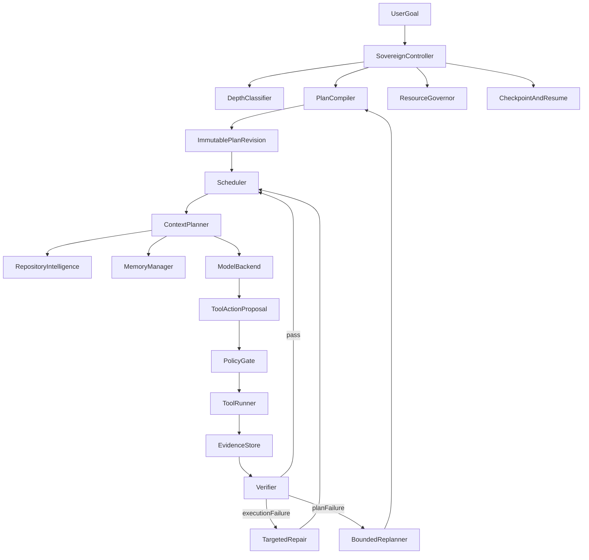
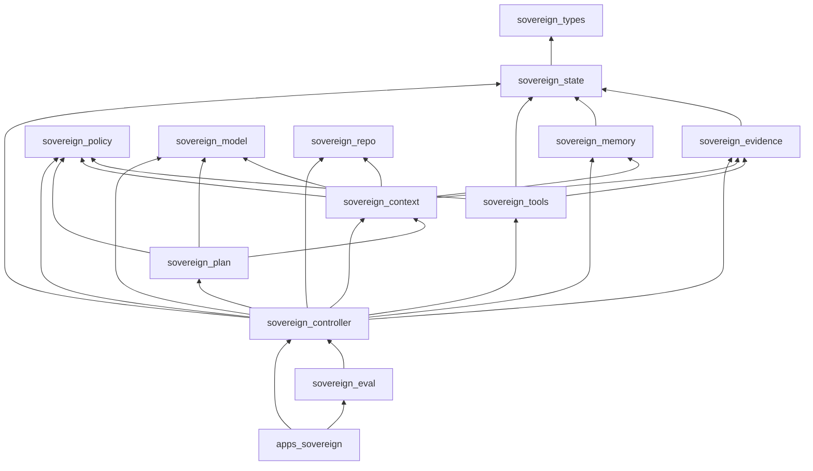

# Architecture

> Snapshot: HEAD `d266399` (2026-09-24) plus uncommitted work (+3440/−604 across 34 files, observed 2026-09-25). **Verified** means checked in that tree. **Historical** may be superseded. **Uncertain** is not proven.

The frozen design contract is [output/SOVEREIGN_ARCHITECTURE.md](../../output/SOVEREIGN_ARCHITECTURE.md), revision **2026-09-12.7**. The frozen roadmap is [output/implementation-plan.json](../../output/implementation-plan.json), id `1.4-frozen`. Implementation must not silently rewrite those contracts. Product-delivery amendments add a profile on top; they do not replace Controller authority. See [01-product-and-goals.md](01-product-and-goals.md) and [19-decisions-and-history.md](19-decisions-and-history.md).

## Decision

Sovereign is a deterministic engineering control plane around a replaceable reasoning engine. The LLM is a worker. It does not own project state, plan state, permissions, retries, completion, memory truth, or resource scheduling.

Default shape, from the architecture and the workspace:

- a small Rust control plane (`apps/sovereign` plus `crates/sovereign-controller`);
- SQLite for authoritative state (`crates/sovereign-state`);
- a content-addressed artifact store for large immutable evidence (`crates/sovereign-evidence`);
- demand-loaded adapters for inference, browser, parsing, and heavy analysis.

The operating rule is **capability richness with runtime sparsity**: many roles, skills, tools, and indexes may exist, while ordinary execution keeps the controller, the state database, a compact repository index, and at most one local model resident. Target machine: MacBook Air M1, 8 GB unified memory. See [12-model-and-resources.md](12-model-and-resources.md).

## Non-negotiable invariants

These twelve items are architecture section 2. Code that contradicts them is a defect.

1. The Controller is the sole authority for execution state transitions.
2. A model response is a proposal until the Controller validates and commits it.
3. Plan revisions are immutable. Replanning creates a new revision and supersedes only affected nodes.
4. A task cannot become complete because the model says it is complete. Required acceptance evidence must exist and pass.
5. Retained raw tool output is durable after mandatory ingress redaction. Model context normally receives a bounded synopsis.
6. Repository content, web content, memories, skill text, and tool output are untrusted. None may silently alter policy or permissions.
7. Skills and roles can narrow behavior but cannot grant permissions.
8. One local model invocation is active at a time on the target machine by default.
9. Semantic retrieval is optional and demand-loaded. Exact, lexical, symbol, and dependency retrieval are the default code paths.
10. A crash after a potentially side-effectful action produces an `unknown` action state until reconciled. Absence of a receipt is not absence of the effect.
11. Sovereign never resets, cleans, force-pushes, or overwrites pre-existing user work to recover its own task.
12. Normal operation remains functional with networking disabled after required models and tools have been acquired.

Security elaboration is architecture section 24.0 and [08-security-and-permissions.md](08-security-and-permissions.md).

## Runtime topology

**Always light.** The control plane should stay useful with no model loaded: repository discovery, Git inspection, DAG validation, checkpoint recovery, search, verification commands, and evidence inspection.

**Demand-loaded.** The Controller owns leases for one `ModelBackend` (normally `llama-server`), an optional embedding worker, a browser/CDP worker, a Scrapling/Python worker, language servers, and build/test commands. Adapters must not open the authoritative SQLite database. **Verified** in code: the production runner composes these in `apps/sovereign/src/runner.rs`. Postgres is not started by Sovereign ([11-browser-and-postgres.md](11-browser-and-postgres.md)).

**Concurrency on M1/8 GB** (architecture section 3.3, encoded by `HardwareProfileV1::m1_8gb`):

| Slot | Default |
| --- | --- |
| Active model calls | 1 |
| Mutating engineering tasks | 1 |
| Browser instances | 0 or 1 on demand |
| Embedding workers | 0 or 1 on demand |
| Heavy index or build jobs | 0 or 1 |
| Language servers | 0 by default, 1 when a task proves they are useful |

Heavy capabilities are not simultaneous slots. Unknown heavy pairs serialize. A second resident local LLM is forbidden. The DAG may express parallelism; the scheduler is serial for model work and repository mutation.

The architecture text still names a process `sovereignd`. **Verified:** the binary is `sovereign` (`apps/sovereign`). There is no separate daemon crate. `sovereign serve` is a loopback control API, not a second authority. See [14-cli-runner-control-api.md](14-cli-runner-control-api.md).

## Ownership

| Concern | Authority | Persistence |
| --- | --- | --- |
| Goals, tasks, attempts, actions | Controller | SQLite `state_records` plus journal |
| Plan revisions | Plan Compiler, committed by Controller | SQLite plus Plan IR JSON |
| Permissions and policy | Controller and policy kernel | SQLite and config, never memory text |
| Repository snapshots and worktrees | Repository manager | SQLite plus Git metadata |
| Raw tool output after redaction | Evidence store | Content-addressed files, digest in SQLite |
| Context packets | Context planner | CAS plus metadata |
| Memory records | Memory manager | SQLite; large bodies may use CAS |
| Search indexes | Repository intelligence | Rebuildable FTS and symbol files |
| Checkpoints and audit | Controller and state | Hash-chained SQLite rows |
| Secrets | Secret broker | Keychain or provider; only references in SQLite |

The architecture suggests `~/.sovereign/cas/` and `~/.sovereign/worktrees/`. **Verified:** the CLI default state file is `.sovereign/state.sqlite3` in the working tree (`SOVEREIGN_STATE_DB` overrides it). CAS location is chosen by the caller that opens `ArtifactStore`. Treat the `~/.sovereign` layout as the design default, and confirm the path in the call site before assuming it.

Stable interface names and owners live in [schemas/interface-contracts/v1.json](../../schemas/interface-contracts/v1.json) and `crates/sovereign-types/src/interface_contracts.rs` (`InterfaceOwner`, `StableInterface`). Forbidden dependency directions:

- `sovereign-types` depends on no product crate.
- `sovereign-state` depends only on `sovereign-types` (plus `rusqlite` and `sha2`).
- `sovereign-evidence` may depend on state and types, not on controller, plan, policy, tools, memory, model, repo, or context.

## Crate graph

`sovereign-policy` has no workspace-crate dependencies. `sovereign-model` and `sovereign-repo` sit beside state rather than on top of the controller. The controller is the composition root for execution. The app and eval crates are clients.

## Sequencing that still applies

Architecture section 28 is still the sequencing story. M1 proved one goal through the canonical compiler, exact retrieval, one local model, the security kernel, tools, evidence, verification, checkpoint/resume, and one repair loop. Later milestones deepen that kernel. They were not allowed to introduce a second compiler, a second state database, or a model-owned completion path. Optional tracks that remain deferred are listed in [18-status-blockers-debt.md](18-status-blockers-debt.md).
