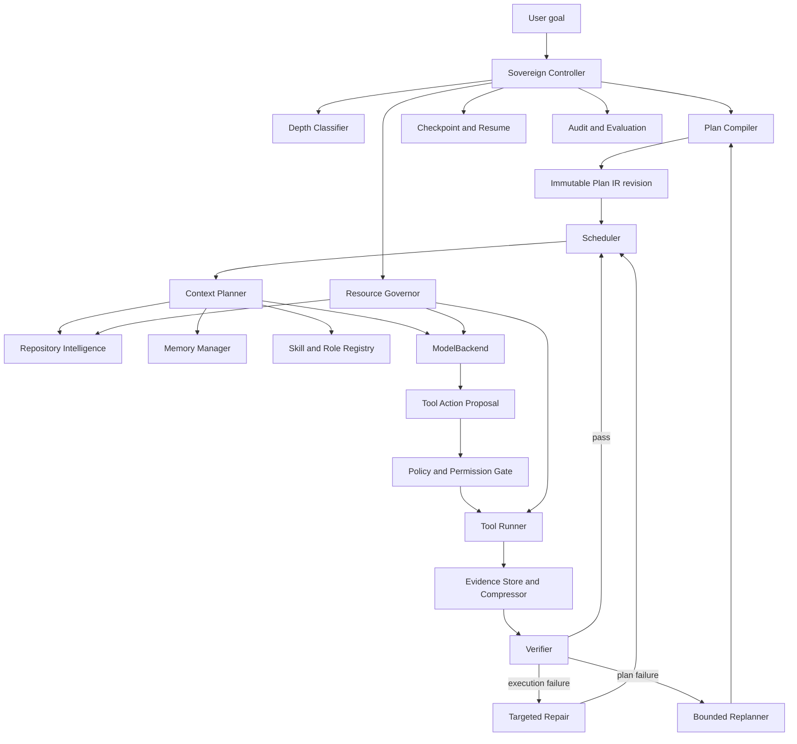

# Sovereign Architecture

Status: **frozen definitive architecture and implementation contract — revision 2026-09-12.7**. This revision carries forward the independently re-audited source boundaries from 2026-09-12.2, the M1/8 GB resource contract from 2026-09-12.3, the Plan IR/controller/recovery hardening from 2026-09-12.4, the weak-model context/memory contract from 2026-09-12.5, and the security/autonomy/resilience contract from 2026-09-12.6. The `.7` amendment changes implementation sequencing only: the first complete M1 vertical slice now includes the canonical minimal Plan Compiler so the goal-to-plan-to-execution path is proven before advanced capabilities. Controller authority, Plan IR v1.2 semantics, security boundaries, runtime sparsity, resource policy, and destination architecture are unchanged. This document designs Sovereign; it does not implement the product.

Target: MacBook Air M1, 8 GB unified memory, macOS, local-first operation, one normally resident 3B-4B class tool-capable model, no paid API or internet requirement during normal operation.

## 1. Architectural decision

Sovereign is a deterministic engineering control plane around a replaceable reasoning engine. The LLM is a worker inside the system. It does not own project state, plan state, permissions, retries, completion, memory truth, or resource scheduling.

The default implementation should use a small Rust control-plane process, SQLite for authoritative state, a content-addressed artifact store for large immutable evidence, and short-lived or demand-loaded adapters for model inference, browser automation, semantic embedding, language servers, and heavyweight repository analysis.

The central design rule is **capability richness with runtime sparsity**. Sovereign may know how to use many roles, skills, tools, indexes, browsers, and model providers while keeping only the controller, state database, a compact repository index, and at most one local model resident during ordinary execution.



## 2. Non-negotiable invariants

1. The Controller is the sole authority for execution state transitions.
2. A model response is a proposal until the Controller validates and commits it.
3. Plan revisions are immutable. Replanning creates a new revision and supersedes only affected nodes.
4. A task cannot become complete because the model says it is complete. Required acceptance evidence must exist and pass.
5. Retained raw tool output is durable and recoverable **after mandatory ingress secret/safety redaction**. Model context normally receives a bounded structured synopsis.
6. Repository content, web content, memories, skill text, and tool output are untrusted data. None may silently alter policy or permissions.
7. Skills and roles can narrow behavior but cannot grant permissions.
8. One local model invocation is active at a time on the target machine by default.
9. Semantic retrieval is optional and demand-loaded. Exact, lexical, symbol, and dependency retrieval are the default paths for code.
10. A crash after a potentially side-effectful action produces an `unknown` action state until reconciled. Sovereign never assumes that absence of a receipt means absence of the external effect.
11. Sovereign never resets, cleans, force-pushes, or overwrites pre-existing user work to recover its own task.
12. Normal operation remains functional with networking disabled after required models/tools have been acquired.

## 3. Runtime topology

### 3.1 Always-light control plane

`sovereignd` is a Rust process or CLI-managed daemon containing:

- Controller and state machine
- SQLite state repository
- Plan Compiler and validators
- task scheduler
- policy/permission engine
- resource governor
- repository metadata/index coordinator
- context planner
- evidence and checkpoint coordinator
- role/skill registry metadata
- provider registry
- evaluation counters

The process should remain useful without a model loaded. Deterministic operations such as repository discovery, Git state inspection, DAG validation, checkpoint recovery, search, verification-command execution, and evidence inspection do not require model inference.

### 3.2 Demand-loaded processes

The Controller owns process lifecycle and leases for:

- one `ModelBackend`, normally `llama.cpp`/`llama-server`, MLX, Ollama, or any OpenAI-compatible local endpoint;
- optional local embedding worker;
- browser/CDP worker;
- Scrapling/Python fetcher worker;
- language server(s);
- build/test commands;
- optional third-party memory or repository-intelligence adapters.

Adapters communicate through bounded typed IPC, normally stdio JSON-RPC or loopback HTTP with a per-launch capability token. A third-party adapter is never allowed direct access to the authoritative SQLite database.

### 3.3 Concurrency policy on M1/8 GB

The DAG supports parallelism, but the default scheduler is deliberately serial for model work and repository mutation. Cheap independent deterministic reads may overlap when the resource governor approves them. The target profile starts with:

- active model calls: 1
- mutating engineering tasks: 1
- browser instances: 0 or 1 on demand
- embedding workers: 0 or 1 on demand
- heavy index/build jobs: 0 or 1
- language servers: 0 by default, 1 when a task proves they are useful

The heavy-capability list is **not** a set of simultaneously available slots. Hardware policy supplies a pairwise exclusion/admission matrix. On the M1/8 GB profile, unknown heavy-capability pairs serialize. A second resident local LLM is forbidden. Embedder + browser/build/optional knowledge build serialize by default. Browser + heavy build serializes. Model + heavy build normally serializes. Small incremental indexing may coexist with a model only after calibration. Adaptive browser mode is the one browser tier that may need model co-residency; it is admitted only when the calibrated combined p95 plus core remains below the normal working-set soft ceiling and the host reserve/pressure checks pass.

Future hardware profiles may raise these limits without changing Plan IR or Controller semantics.

## 4. Authoritative state ownership

| Concern | Authority | Persistence |
| --- | --- | --- |
| projects, goals, requirements | Controller | SQLite |
| plan revisions and DAG | Plan Compiler, committed by Controller | SQLite + canonical Plan IR JSON artifact |
| task/attempt/action state | Controller | SQLite transaction log |
| permissions and policy | Controller | SQLite/config; never memory text |
| repository snapshots | Repository Manager | SQLite + Git metadata |
| post-ingress raw tool output | Evidence Store | CAS files, hash referenced from SQLite |
| context packets | Context Planner | CAS + SQLite metadata |
| memory records | Memory Manager | SQLite; large bodies may use CAS |
| search indexes | Repository Intelligence | rebuildable FTS/symbol/index files |
| checkpoints | Checkpoint Manager | SQLite + CAS manifest |
| roles/skills | Registry | versioned files + index metadata |
| secrets | Secret Broker | macOS Keychain or external secret source; only references in SQLite |
| telemetry/evaluation | Evaluation Engine | SQLite aggregates + append-only event records |

The implementation should use SQLite WAL mode. Normalized current-state tables are authoritative; an append-only event table records every state transition and security-sensitive decision for audit/replay. This avoids requiring a fully event-sourced product while still providing durable history.

Large immutable objects use a content-addressed store under a default root such as `~/.sovereign/cas/sha256/<prefix>/<digest>`. Writes use temporary files, fsync where meaningful, atomic rename, then a SQLite transaction that publishes the digest. Orphaned unreferenced objects can be garbage-collected after a grace period.

Project indexes and controller-owned worktrees live outside the user's repository by default, under `~/.sovereign/projects/<project-id>/` and `~/.sovereign/worktrees/<goal-id>/<task-id>/`.

## 5. Core component boundaries

### Sovereign Controller

Owns the autonomous loop, authoritative transitions, scheduling, retry budgets, escalation, resource leases, policy gates, checkpoint cadence, stale-state handling, and completion governance. It never delegates state ownership to a model provider or tool plugin.

### Project and Repository Manager

Registers repositories, discovers repository instructions such as `AGENTS.md`, records Git HEAD and dirty state, creates controller-owned worktrees when justified, snapshots diffs, and computes freshness fingerprints. It treats user pre-existing changes as protected input.

### Depth Classifier

Selects the smallest reliable execution strategy using deterministic features plus a bounded model classification only when deterministic signals are insufficient.

### Plan Compiler

Converts a goal or supplied plan into validated Plan IR. It resolves repository references, builds a dependency graph, attaches verification contracts, permissions, roles, skills, context/resource budgets, and failure policies, then rejects or splits ambiguous/unverifiable work.

### Scheduler

Selects the next ready task from the active immutable plan revision. Readiness is a computed property, not model opinion: dependencies passed, checkpoints resolved, required repositories present, resource lease feasible, baseline not stale, and permission preconditions satisfied.

### Repository Intelligence

Maintains rebuildable exact/lexical/symbol/dependency indexes and exposes one retrieval interface. It does not own project truth; source files and Git remain truth.

### Context Planner

Constructs minimal evidence packets for the model. It owns token allocation, progressive loading, evidence deduplication, provenance, freshness, and cache-friendly stable prefixes.

### Memory Manager

Stores durable project facts, decisions, episodic outcomes, known failures, and procedural candidates with provenance, confidence, trust state, versioning, invalidation predicates, and supersession. Recalled memory remains evidence, not authority.

### Role and Skill Registry

Indexes metadata for roles and skills without loading their bodies. It resolves only the role/skills needed by the current task. The default role set is intentionally small: Explorer, Planner, Implementer, Debugger, Reviewer, Security Reviewer, and Verifier. These are logical profiles over the same model.

### Tool Registry and Runner

Describes tools by typed input/output, risk class, resource cost, network requirements, side effects, timeout, and idempotency/reconciliation behavior. The runner executes only Controller-authorized actions inside allowed roots and process limits.

### Evidence Store and Compressor

Stores the lossless **post-ingress** tool stream after mandatory secret/safety filtering, produces deterministic structured synopses, assigns failure signatures, and allows bounded drill-down by range/query. Lossy model-facing compression never destroys the retained post-ingress artifact. If an output exceeds its raw-artifact spool quota, the store records an explicit truncation/segmentation event and preserves the retained byte ranges plus counters; it never silently drops tail data while claiming a complete raw artifact.

### Verifier

Executes acceptance checks and records evidence. It can use a separate reviewer role for semantic review, but the Controller determines pass/fail from the acceptance contract.

### Resource Governor

Tracks current RSS/pressure, predicted leases, model residency, idle TTLs, and mutually exclusive heavyweight capabilities. It may unload the model between reasoning phases to make room for a browser, compiler, or indexer.

### Model Router

Exposes one provider-independent `ModelBackend` contract. Normal operation chooses a local backend. Optional remote models are escalation providers and never dependencies of baseline execution.

## 6. Provider contracts

The exact language syntax can change during implementation; semantic contracts should not.

```rust
trait ModelBackend {
    fn capabilities(&self) -> ModelCapabilities;
    async fn load(&self, profile: ModelLoadProfile) -> Result<ModelLease>;
    async fn complete(&self, req: ModelRequest) -> Result<ModelResponse>;
    async fn count_tokens(&self, content: &ContextPacket) -> Result<u32>;
    async fn health(&self) -> Result<BackendHealth>;
    async fn unload(&self) -> Result<()>;
}

trait RepositoryIntelligence {
    async fn refresh(&self, repo: RepoId, delta: RepoDelta) -> Result<IndexSnapshot>;
    async fn exact(&self, query: ExactQuery) -> Result<EvidenceSet>;
    async fn lexical(&self, query: LexicalQuery) -> Result<EvidenceSet>;
    async fn structural(&self, query: StructuralQuery) -> Result<EvidenceSet>;
    async fn semantic(&self, query: SemanticQuery) -> Result<EvidenceSet>;
}

trait ToolAdapter {
    fn manifest(&self) -> ToolManifest;
    async fn invoke(&self, authorized: AuthorizedAction) -> Result<RawToolResult>;
    async fn reconcile(&self, action: ActionId) -> Result<Reconciliation>;
}
```

`ModelBackend` cannot write Controller state. `RepositoryIntelligence` returns evidence identifiers with source hashes. `ToolAdapter` receives a capability-scoped authorization object rather than unrestricted global policy.

## 7. Autonomous depth selection

Depth is selected before planning and can be raised when evidence shows unexpected coupling. It can be lowered for remaining work after uncertainty is removed.

| Depth | Use | Typical machinery |
| --- | --- | --- |
| D0 Direct | deterministic or tiny edit with obvious scope | exact lookup, one patch, focused verification |
| D1 Focused | bounded single-module bug/change | repo evidence, one role, one task, focused tests |
| D2 Plan-lite | multi-file feature in one subsystem | small DAG, implementation + independent verify/review |
| D3 Full plan | architectural/multi-module work | full Plan IR, branch/worktree isolation, dependency graph, staged verification |
| D4 High-risk | auth/security/data migration/multi-repo/public API | full evidence pass, explicit rollback, dedicated review gates, cross-repo checkpoints |

The classifier computes deterministic feature scores for:

- repository count and language count;
- expected files/modules/symbols touched;
- security/auth/secret sensitivity;
- schema or data migration;
- public API/protocol compatibility;
- unknown technology or dependency;
- test coverage/verification availability;
- architecture uncertainty;
- blast radius and dependency centrality;
- prior failure rate for similar tasks;
- destructive or external side effects.

Hard overrides raise depth regardless of aggregate score: irreversible data migration, authentication/authorization changes, secrets, multi-repository coordinated protocol change, or absent rollback for a destructive action.

The classifier persists the feature vector, chosen depth, and reason. This allows later evaluation of over-planning and under-planning.

## 8. Plan Compiler

### 8.1 Inputs

The compiler accepts:

- a short natural-language goal;
- structured requirements;
- architecture or product documents;
- a human-written plan;
- a plan from an external stronger model;
- a previous Sovereign plan revision.

No input is trusted simply because it came from a strong model.

### 8.2 Compilation pipeline

1. **Normalize intent** into goal, requirements, invariants, explicit exclusions, and unresolved questions.
2. **Capture baseline evidence**: repositories, instructions, revisions, dirty state, language/tool markers, tests, high-level architecture.
3. **Classify depth** and select the planning template.
4. **Resolve requirements** to concrete deliverables and evidence needs.
5. **Decompose** into cohesive independently verifiable tasks. Tests stay with the behavior they verify unless a distinct integration gate is required.
6. **Resolve scope** to repositories/files/symbols when known. Unknown paths become explicit evidence requirements, never invented paths.
7. **Build dependency DAG** from real produced/consumed contracts. Every hard dependency receives a machine-readable `dependency_binding` naming the upstream artifact(s) and/or accepted criterion(s) that the downstream task consumes.
8. **Attach execution contracts**: role, skills, tool classes, permissions, context/resource budgets, artifacts, acceptance, verification, rollback, retry/replan policy.
9. **Validate** graph and contracts.
10. **Persist immutable revision** as canonical JSON plus normalized DB rows.

### 8.3 Validation gates

A plan cannot become active if any required task has:

- a missing or unknown dependency;
- a cycle in hard dependencies;
- no objective or ambiguous expected output;
- no acceptance criterion;
- acceptance criteria with no producible evidence;
- verification that cannot run in the declared environment without an explicit manual gate;
- a scope too broad to bound safely;
- a task so broad that implementation and verification cannot complete within its budgets;
- a trivial fragment that creates needless model handoffs without an independent verification boundary;
- permissions that exceed task need or global policy;
- unavailable required capability;
- an unresolved repository reference;
- destructive mutation without rollback/recovery semantics;
- impossible resource combination for the active hardware profile;
- a side-effectful action with no idempotency or reconciliation policy;
- a stale prerequisite snapshot;
- a hard dependency without exactly one valid dependency binding to produced upstream artifacts/acceptance evidence;
- an execution-gating evidence requirement without a stable requirement ID, explicit satisfaction rule, and freshness domain;
- a mutating/destructive/external-side-effect task whose rollback is `none`, or whose non-`none` rollback has no typed verification step;
- an untrusted-code/process action whose requested filesystem/network/secret boundary cannot be enforced by an available `ExecutionIsolationBackend`;
- a verification/tool `CommandSpec.timeout_seconds` that exceeds the task's `max_single_tool_action_seconds`, or a model/backend call policy that exceeds `max_model_call_seconds`;
- a write-like network/browser action (`POST`/`PUT`/`PATCH`/`DELETE`, form submission, upload, remote Git/package mutation, or equivalent side effect) without `network_write`/`external_side_effect` authority and reconciliation semantics;
- an `external_intelligence` task request whose provider/data classes/payload limit are broader than global external-intelligence policy or lack any required exact grant;
- task count or plan/replan lineage that exceeds global `max_tasks_per_revision`, `max_plan_revisions`, or `max_replans_per_scope`;
- contradictory failure routing between `failure_policy` and `next_state_rules`;
- an unhandled conflict between requirements.

Plan validation produces machine-readable diagnostics. Where safe, the compiler can split/repair the smallest invalid task and revalidate. It does not silently waive a failed gate.

The "declared environment" is not a free-text shell assumption. Semantic validation resolves every verification `CommandSpec.tool_id` against the task's digest-pinned tool capabilities/ToolManifest plus repository/toolchain evidence captured for that baseline. It also intersects each action with the selected isolation backend's declared enforceable controls. A plan cannot invent an executable/runtime version or sandbox capability merely to satisfy validation; if the environment/isolation capability is unknown, the compiler records a bounded evidence requirement or explicit manual gate.

## 9. Plan IR v1.2

`plan-ir.schema.json` in this output directory is the normative machine-readable schema. The semantic model is:

```text
PlanIR
  identity: plan_id, revision, schema_version, compiler_version
  project: project_id, workspace roots
  goal: statement, invariants, source
  requirements[]: id, priority, text, evidence expectations
  repositories[]: id, canonical root, VCS baseline, instructions, optional index snapshot
  depth: D0-D4 plus classifier evidence
  global_policy: capability ceiling, filesystem/process/network/secret/browser/approval/audit/external-intelligence policy, retry/replan ceilings, escalation, checkpoint integrity, resource/deadline ceilings
  tasks[]:
    task_id
    objective and rationale
    requirement mappings
    dependency ids
    dependency bindings to upstream artifact/criterion IDs + freshness rule
    working scope: repos/files/symbols/create/delete boundaries
    required evidence with stable requirement IDs, explicit satisfaction rules, and freshness domains
    digest-pinned role
    digest-pinned skills
    digest-pinned tools and requested permission classes
    action policy: write roots, network scope, package policy, browser scope, task-scoped external-intelligence provider/data limits, secret handles, approval classes
    implementation contract: stable-ID preconditions/assumptions/inputs/outputs/invariants/non-goals
    expected artifacts
    acceptance criteria mapped to typed verification-step IDs + evidence-freshness policy
    typed verification procedures and expected evidence
    failure policy including retry/same-failure exhaustion outcomes
    rollback/recovery including typed rollback verification
    resource budget
    context budget
    checkpoint policy
    next-state rules
  edges[]: supplemental produced-for / serialization / invalidation relations
  completion_gate
  provenance
```

Task nodes are executable contracts. A local executor should not need conversation history to know why the task exists, what it may touch, what evidence it may use, what success means, or what to do after a failure. `task.dependencies[]` is the **only authoritative hard-dependency DAG**. `task.dependency_bindings[]` does not create another graph: it must contain exactly one binding for each existing dependency ID and identifies which upstream `expected_artifacts` and/or accepted criteria are required before the downstream task can be ready. Top-level `edges[]` can describe output-flow, serialization, and invalidation relations but cannot introduce a second hard dependency graph.

`repositories[].index_snapshot_id` may be `null` in the M1 exact-retrieval slice. It becomes required by semantic validation only when a task requests lexical/symbol/dependency/semantic indexed evidence. This prevents M1 implementers from fabricating a rich index identifier before M2 exists.

Security-sensitive execution fields are normative Plan IR, not prose conventions. Verification commands use a structured `CommandSpec` (tool ID, execution mode, executable, argument vector, repository ID, repository-relative working directory, literal environment, secret-handle environment, timeout, output cap) rather than an opaque shell string. Global policy fixes the plan's maximum requested capability set plus Controller-owned path, process, network, secret, browser, checkpoint-integrity, and approval invariants; each task's `action_policy` can only narrow them. Plan IR itself never grants a capability: effective authority is still intersected with Controller policy and any explicit user grant at runtime.

Roles, skills, and tools are pinned by ID, version, and content digest. A registry update cannot silently change the semantics of an already-compiled plan. Preconditions, invariants, and assumptions also carry stable IDs; assumptions additionally record basis evidence and the minimum invalidation scope (`task`, `dependency_branch`, or `plan`) so a plan failure can target the exact affected scope.

Evidence requirements are stable runtime obligations, not retrieval suggestions. Each carries `requirement_id`, `required_before`, `satisfaction`, and `freshness`. The Controller persists an `EvidenceSatisfaction` record containing the requirement ID, query/evaluator digest, evidence IDs, repository/plan snapshot binding, and satisfaction time. `exactly_one` means one valid result; `at_least_one` means one or more valid results; `query_completed` means only that the bounded query completed and its result set was retained; `evaluator_pass` means a digest/version-pinned governed evaluator ran over that retained evidence and passed. **Negative/absence claims that gate execution require `evaluator_pass`; zero hits are not self-proving.** A task cannot become ready for execution while an execution-gating requirement is unsatisfied.

Evidence requirement IDs are unique across the whole task contract, including requirements nested under preconditions/invariants. Dependency bindings may reference only upstream artifacts/criteria marked required (or the binding itself makes them required during compilation); optional output cannot silently become a readiness prerequisite. The Plan Validator also checks that any evidence/rollback evaluator is registered and digest/version-pinned by the execution environment, that any `rollback.verification_steps[].command_spec.tool_id` resolves to a task tool, and that rollback verification cannot require permissions broader than the task/Controller ceiling. `rollback.mode=none` is allowed only for a task with no repository/external/destructive mutation to undo; mutating tasks need a reversible or compensating mode.

Acceptance criteria reference typed verification-step IDs and declare evidence freshness (`current_attempt`, `current_task_revision`, or guarded carry-forward). Command steps use `CommandSpec`; assertion/diff steps require an evaluator; artifact/review/manual steps require their corresponding typed target. The Plan Validator rejects orphan criteria, orphan verification steps, duplicate IDs, mismatched evidence types, and any required criterion that has no executable or explicitly governed verification path. Evidence carried from an older attempt/revision satisfies a required criterion only when its declared freshness policy allows carry-forward **and** all input/dependency/source fingerprints revalidate.

`current_task_revision` means evidence produced under the same active task-contract digest and still-valid execution baseline; a later mutation that could affect that criterion invalidates it. `carry_forward_if_inputs_unchanged` may cross a superseding plan revision only through the explicit carry-forward proof described below. `current_attempt` can never be satisfied by an earlier attempt.

## 10. State machines

Do not overload one status field with plan, task, attempt, and side-effect state. Sovereign uses separate machines.

### 10.1 Plan revision

```text
draft -> validating -> active -> completed
              |          |
              v          v
           rejected   superseded
```

An active plan revision is immutable, and **exactly one plan revision is active for a goal at a time**. Replanning produces `revision + 1`, copies unchanged task contracts by stable ID/content hash, carries forward still-valid evidence/checkpoints explicitly, and atomically activates the new revision while marking the previous revision superseded. "Unaffected branches remain active" means their unchanged task contracts continue in the new active revision; two revisions never execute concurrently for the same goal.

Plan lifecycle and runtime freshness are separate. An immutable active revision also has Controller-owned `PlanValidity = current | stale_evidence | invalidated`. Repository drift first sets `stale_evidence` and blocks **new mutation dispatch**. The Controller refreshes only the affected task/dependency/input fingerprints. If the drift is unrelated and every affected precondition/assumption/dependency binding revalidates, validity returns to `current` with a durable freshness record; the Plan IR JSON is not mutated. If a scoped input, dependency output, requirement, or assumption no longer holds, validity becomes `invalidated` and the smallest affected scope is replanned into revision N+1. A stale plan is never executed merely because its plan lifecycle status still says `active`.

The Controller also maintains a monotonic runtime `execution_epoch` for authorization/readiness. Plan activation/supersession, entry into `stale_evidence`, relevant repository-baseline change, policy/grant change, or recovery reconciliation that changes task/action truth increments the epoch. Ready leases and not-yet-dispatched `AuthorizedAction`/approval claims bind that epoch. An epoch change invalidates them and forces freshness/permission re-evaluation before dispatch, preventing a previously approved action from executing against newly changed evidence.

### 10.2 Task

```text
planned ---------------------------> running -> verifying -> succeeded
  ^                                   |          |
  |                                   |          +-> repair_pending --+
  |                                   |          +-> replan_pending -> superseded
  |                                   +-> awaiting_approval -----------+
  |                                   +-> deferred_resource -----------+
  |                                   +-> reconciling_unknown --------+
  |                                   +-> failed_terminal
  |
  +------------------- eligible nonterminal states after guards recover

rollback_pending -> rolling_back -> rolled_back
                           |
                           +-> blocked (rollback outcome not proven)

terminal: succeeded | failed_terminal | cancelled | superseded | rolled_back
```

`ready` and `blocked` are **derived scheduler views**, not durable task states that survive by assertion. Durable task state plus current Controller evidence determines whether the scheduler view is ready or blocked. This prevents a persisted pre-crash `ready=true` bit from bypassing freshness/recovery checks after restart. `awaiting_approval`, `deferred_resource`, and `reconciling_unknown` return to eligibility only after their exact blocking condition is durably resolved; they do not jump directly to mutation.

`ready` is a computed state, not a model/Plan-IR assertion. A nonterminal task is `ready` **iff** all of the following hold at the same Controller epoch:

1. its plan revision is the sole active revision and `PlanValidity=current`;
2. every hard dependency is `succeeded` (or explicitly carried forward into this revision) and every `dependency_binding` resolves to present, digest-valid, freshness-valid upstream artifact/criterion evidence;
3. all evidence requirements whose `required_before=execution` have durable valid `EvidenceSatisfaction` records;
4. repository/task input fingerprints and scoped instructions are fresh;
5. the latest valid checkpoint/action journal is reconciled and no action is `unknown`;
6. requested task capabilities are still possible under Controller/project/task/role/tool ceilings (exact action approval may still be requested later); and
7. required resource/repository leases are admissible, otherwise the task is `deferred_resource` rather than `ready`.

A task in `repair_pending` retains exactly the same task contract digest. A task in `replan_pending` has durable evidence that a precondition/assumption/output/dependency contract changed and therefore cannot return to `ready` under the same task contract.

The legal transition graph is hard-coded Controller behavior. Authority order is: **Controller invariant/state graph → task `failure_policy` default routing → compatible `next_state_rules` narrowing**. `next_state_rules` may add guards or select among transitions already allowed by the corresponding failure policy; they cannot contradict it, add a legal edge, bypass retry exhaustion, or authorize success/cancellation/rollback by model text. The Plan Validator rejects a rule that routes an event to a transition the task's failure policy would forbid.

`failure_policy` is the single default authority for failure routing. `on_execution_failure=repair` applies only while both `max_attempts` and `same_failure_limit` permit another attempt. When either budget is exhausted, `on_attempts_exhausted` / `on_same_failure_exhausted` deterministically selects `block`, `fail`, or permitted escalation; missing `next_state_rules` cannot accidentally create another retry. `on_plan_failure=replan_smallest_scope` is the preferred default: the Controller derives `task | dependency_branch | plan` from the invalidated stable clause/binding and may never choose a scope smaller than its declared invalidation scope.

Counter semantics are exact: `max_attempts` counts all started execution attempts for that task contract, including the initial attempt; `same_failure_limit` counts occurrences of one normalized failure signature across those attempts. A new repair attempt requires **both** counters to remain below their limits after the just-finished attempt is recorded. Reaching the same-failure limit blocks another identical repair even if total-attempt capacity remains. Resource-admission failures that occur before an execution attempt is started consume `resource_retry_limit` but do not fabricate an execution attempt; once execution has started, its attempt count remains consumed even if it later ends in a resource failure.

### 10.3 Attempt

```text
prepared -> executing -> verifying -> succeeded
              |             |
              |             +-> failed
              +-> failed
              +-> aborted
              +-> interrupted
```

Every retry is a new attempt with inherited task identity, task-contract digest, execution baseline, consumed dependency-binding digests, and explicit failure evidence. The Controller never erases the previous attempt. A failed verification closes the current attempt as `failed`; failure classification then routes the **task** to repair, replan, resource defer, permission block, or terminal failure. An attempt never mutates itself back to `executing`.

### 10.4 Tool action

```text
prepared -> authorized -> dispatched -> observed -> committed
                               |
                               +-> unknown -> reconciled -> committed/failed
```

`committed` means the observed action outcome/receipt is durably recorded; it does **not** mean the command succeeded. A process with exit code 1 may have a `committed` action record whose result becomes execution-failure evidence. `failed` at the action layer is reserved for an authorization/dispatch/reconciliation outcome that proves the action itself did not complete as intended. For a read or idempotent local command, reconciliation may safely retry under policy. For an external or irreversible action, `unknown` blocks automatic replay unless the adapter can prove whether the effect happened.

## 11. Autonomous execution loop

The Controller runs this loop; models participate only in bounded steps.

1. Load or create project and goal state.
2. Refresh repository baseline and instructions.
3. Determine execution depth.
4. Load a compatible active plan or compile a new revision.
5. Validate plan and freshness.
6. Select one ready task.
7. Acquire resource and repository leases.
8. Select role and skill metadata.
9. Retrieve task evidence using the deterministic retrieval router.
10. Build a bounded context packet.
11. Invoke the local model for a typed decision/action proposal.
12. Validate proposal against schema, scope, permission, and policy.
13. Journal and execute authorized tool actions.
14. Store raw results and return compressed evidence.
15. Repeat bounded tool/model turns until the attempt reaches its execution stop condition.
16. Run task verification.
17. Classify failures as execution failure, plan failure, environment failure, permission block, or unknown action outcome.
18. Repair, replan smallest affected scope, block, or progress.
19. Write checkpoint and update memory/evaluation records.
20. Recompute ready tasks.
21. When no required work remains, run project completion gates.

Every loop has ceilings for model turns, tool actions, wall time, tokens, and repair attempts. “Keep trying” is never an unbounded policy.

Immediately before the first mutating action of an attempt, the Controller rechecks the same readiness epoch: active-plan identity, task-contract digest, dependency-binding digests, execution-gating evidence satisfaction, repository fingerprints, permission possibility, and no-unknown-action invariant. Any mismatch invalidates the ready lease and returns to freshness/replan handling instead of mutating from a stale decision.

## 12. Execution failure vs plan failure

The Controller records a `FailureRecord` with a normalized signature, evidence references, affected assumption/precondition, classification, confidence, and the decision that followed.

### Execution failure

The task contract is still valid and evidence says implementation or tooling failed. Examples: compile error after an edit, one failing test, incorrect API call where the API does exist, transient tool failure.

Default response:

1. compress the failure into a targeted failure packet;
2. retry the same task with the same acceptance contract;
3. use a debugging/reviewer skill if the failure signature repeats;
4. expand only the evidence implicated by the failure;
5. stop identical retries at the task's `same_failure_limit`.

### Plan failure

Evidence falsifies an assumption needed by the task or branch. Examples: planned API does not exist, architecture differs from the baseline, a dependency output contract is wrong, required subsystem is absent, requirements conflict, supposedly isolated code is coupled across services.

Default response is smallest-scope replanning:

- wrong implementation detail with unchanged task output contract: recompile that task;
- task output contract changes: recompile task plus descendants consuming that output;
- dependency/order/interface invalid: recompile the affected dependency branch;
- root requirement or architecture invalid: create a new broader plan revision;
- unrelated branches are copied unchanged into the new active revision if their inputs, assumptions, fingerprints, and invariants still hold.

Carry-forward is explicit, never inferred from matching task IDs alone. A task/acceptance result may be carried into revision N+1 only when the task-contract digest is identical, every dependency binding still resolves to the same accepted upstream contract/evidence (or an explicitly compatible replacement), all relevant source/input fingerprints validate, its acceptance criterion freshness policy permits carry-forward, and no action remains unknown. Otherwise the task returns to planned/blocked in N+1 and must execute or verify again.

The model may propose a classification; the Controller confirms it by checking whether cited evidence invalidates a Plan IR precondition, invariant, resolved symbol/repository assumption, or dependency contract.

### Resource/environment failure

Memory pressure, disk quota, process admission failure, toolchain absence, or similar environment limits are neither implementation mistakes nor automatically plan failures. They use a separate resource retry budget. The default action is to checkpoint, evict/degrade optional capability, and retry only when the measured condition changes or budget permits. Repeated resource failure eventually defers/blocks with exact evidence; it does not justify L5/L6 replanning unless the evidence also invalidates a task/plan assumption.

## 13. Intelligence escalation ladder

| Level | Action | Trigger |
| --- | --- | --- |
| L0 | deterministic software | operation requires no semantic decision |
| L1 | local model on bounded task packet | normal task reasoning |
| L2 | same local model + targeted failure evidence | first execution failure |
| L3 | add specialist role/skill | repeated known-class failure or domain-sensitive review |
| L4 | selectively expand context | evidence gap identified explicitly |
| L5 | replan current task | task assumption/contract invalid |
| L6 | replan affected dependency branch | interface/order/coupling invalid |
| L7 | optional stronger external model or human | local ceiling reached or policy requires it |

External intelligence is a provider plugin. Plan IR, evidence packets, and failure records are portable so an external architect can receive the same structured state without being a hidden dependency.

## 14. Repository intelligence

### 14.1 Index layers

Sovereign keeps source-of-truth and indexes separate:

- Git/filesystem truth: actual files and repository metadata.
- exact index: file names, paths, hashes, `rg`/literal search.
- lexical index: SQLite FTS5/BM25 over bounded code/doc chunks and symbol names.
- symbol index: tree-sitter definitions, references where reliably derivable, language/module boundaries.
- dependency graph: imports, package/module dependencies, build graph, test-to-source relationships.
- optional semantic index: local embeddings persisted cold and loaded only when lexical/structural retrieval is insufficient.
- optional LSP evidence: live language-server query when a task justifies its memory cost.

No repository fact becomes durable memory solely because an index says so; evidence carries file hash and repository snapshot.

### 14.2 Incremental refresh

At project registration, build path/language/instruction metadata first. Build FTS and symbol indexes incrementally. Repository truth is refreshed from the filesystem/Git **before retrieval results can be considered fresh**. The refresh pipeline is:

1. capture current HEAD/branch plus staged, unstaged, and untracked fingerprints;
2. compare the new repository snapshot with the last indexed snapshot;
3. hash changed/new files and record deleted paths;
4. invalidate exact/FTS/symbol/dependency projection rows whose source fingerprints no longer match;
5. reindex changed files in bounded batches;
6. enqueue dependency-neighbor refresh only for affected imports/modules/tests;
7. publish a new `IndexSnapshot` only after its source-fingerprint manifest is complete;
8. mark memory records that depend on changed fingerprints `stale` before they can be selected as validated context.

An index hit whose source hash does not match the current repository snapshot is **not returned as current evidence**. The router either refreshes that bounded source or falls back to an exact source read. Index freshness never outranks source truth. Large repository indexing is resumable and checkpointed, and useful exact-search tasks may run while richer indexes are incomplete.

The scheduler may execute useful exact-search tasks before a full index completes.

## 15. Context engineering

The model context is a cache over persistent knowledge, not the knowledge store itself.

### 15.1 Context levels

| Level | Contents | Default behavior |
| --- | --- | --- |
| C0 Contract | task objective, why, acceptance, constraints, permissions, budgets, plan revision | always present, exact |
| C1 Direct evidence | relevant file/symbol slices, current diff, focused test/config evidence | always bounded to task |
| C2 Structural neighborhood | callers/imports/dependencies, adjacent interfaces, ADR references | add when coupling matters |
| C3 Project memory | validated facts, prior failures, user/project decisions | targeted retrieval only |
| C4 Broad semantic/docs | fuzzy conceptual evidence, external docs already acquired | only after retrieval gap |
| C5 Branch/plan context | broader plan nodes and cross-repo architecture | escalation/replanning only |

### 15.2 Deterministic retrieval router

Route by question type before considering embeddings:

- known path -> direct file read;
- identifier/symbol -> exact search + symbol index;
- “where is X implemented?” -> lexical BM25 + definitions + import/call neighbors;
- change-impact query -> dependency graph + references + tests;
- current working change -> Git diff + touched-symbol graph;
- historical failure/decision -> memory index by task/repo/symbol/failure signature;
- vague conceptual query after lexical miss -> optional semantic candidates, reranked with lexical/structural evidence;
- architecture question -> ADR/governed docs + module graph first.

Semantic similarity never overrides an exact current source fact.

The router is a **typed decision table with stop conditions**, not an LLM preference. It records a `RetrievalTrace` containing the query intent, selected channel(s), reason, candidate counts, source snapshot, freshness checks, reranking/expansion decisions, and the stop condition. The normal routing order is:

| Query intent | Primary path | Optional expansion | Stop condition |
| --- | --- | --- | --- |
| known file/path/range | exact filesystem read | adjacent range only | requested locator resolved on current hash |
| literal/config/key/error text | exact/`rg` | FTS if exact set is too broad | bounded unique current-source hits |
| identifier/type/function/class | exact symbol name + symbol index | references/import neighborhood | definition/current references resolved |
| “where is behavior X implemented?” | FTS/BM25 | symbol definitions, then dependency neighbors | high-confidence source-bearing implementation set found |
| callers/importers/dependents/tests/impact | dependency + symbol/reference graph | exact source confirmation | affected neighborhood bounded and source-confirmed |
| current change/regression | Git diff first | touched-symbol/dependency/test neighborhood | relevant hunks and affected verification surface found |
| prior failure/fix | episodic lookup by normalized failure signature + repo/tool/symbol | lexical memory search | fresh matching episode with source links or no qualified hit |
| prior decision/requirement | governed-memory/ADR exact+lexical | provenance expansion | current governed source found or conflict surfaced |
| vague conceptual phrase | FTS/BM25 first | **semantic only after lexical/structural gap** | grounded source candidates obtained or bounded miss declared |
| architecture/topology | ADR/docs + module/dependency graph | lexical source confirmation | current architecture evidence set bounded |

Graph retrieval is normally **anchor expansion**, not blind first-pass search: start from a source/symbol/task/memory anchor and expand a bounded neighborhood. The exception is an explicitly topological query such as “what depends on module X?”, where the dependency graph is itself the deterministic primary index. Memory graph edges never turn memory into source truth.

Semantic retrieval is an optional **candidate generator**, never the default router. It may activate only when all of the following are true: the task permits C4/semantic evidence; an exact/lexical/structural route recorded a specific retrieval gap or the query is inherently fuzzy; the semantic index is fresh enough for the selected corpus; resource policy admits the embedder/vector lease; and a bounded semantic candidate cap is available. Semantic candidates must be reranked/grounded against lexical, path, symbol, provenance, and current-source evidence before entering the model packet. A semantic hit alone cannot establish a repository fact, satisfy a destructive-action precondition, or override governed/current evidence.

On the M1/8 GB profile, semantic retrieval initially returns at most **12 candidates for reranking and injects at most 4 semantic-derived evidence items** into a single model packet. Those limits are calibration defaults, not quality claims; a profile may lower them. Raising them requires measured retrieval value and token/resource fit, not merely a larger vector corpus.

Default bounded router behavior is **retrieve -> evaluate sufficiency -> stop or expand one level**. The Controller does not fan out to every retriever and merge everything “for recall.” A normal task should therefore generate a small trace such as `exact -> symbol -> stop`, not `exact + FTS + graph + vector + memory`.

### 15.3 Evidence packet

Every model invocation receives a typed packet whose items contain:

- evidence id and kind;
- source URI/path and repository id;
- source snapshot/hash;
- line/symbol locator;
- provenance and trust class;
- freshness timestamp;
- relevance/routing reason;
- token cost;
- exact text or deterministic synopsis;
- expansion handle if truncated.

Packets deduplicate identical content by digest and prefer references to already-known stable facts. A stable system/role/tool-prefix layout improves prompt caching for backends that support it.

### 15.4 Exact weak-model packet contract

A 3B-4B model should receive **small typed facts in a stable order**, not a transcript. Every invocation is rebuilt from canonical state and current evidence; previous model prose is not automatically appended. The packet order is:

1. **controller prefix**: role/output schema and immutable safety boundary; only relevant tool schemas are advertised;
2. **C0 task contract**: objective, rationale, required outputs, acceptance criteria, constraints/non-goals, active plan/task/revision digests, effective permissions, remaining budgets;
3. **current state summary**: attempt number, already committed Controller actions, unresolved blockers/unknown actions, current repository/diff fingerprints;
4. **C1 direct evidence**: exact current source slices, relevant config/tests, current diff, each with locator/hash/provenance;
5. **C2/C3 only when routed**: bounded structural neighbors and/or validated memory synopses, explicitly labelled as secondary evidence;
6. **tool/failure evidence**: deterministic synopses from the current attempt plus expansion handles, not raw logs;
7. **requested decision schema**: the exact next proposal type the Controller will accept.

Information that **does not** enter the model by default includes full repository trees, full files when slices suffice, raw chat/session history, raw tool logs, all memories, all skills, all tool schemas, complete plan DAGs, vector embeddings/scores, index internals, unrelated task attempts, or another role's hidden reasoning trajectory.

Invocation-specific packets are deliberately different:

| Invocation | What reaches the model | What stays out |
| --- | --- | --- |
| discovery/planning | goal/requirements, repository inventory + instructions, high-level current architecture facts, unresolved evidence questions, bounded source/FTS/symbol evidence | implementation-sized file dumps, episodic history unless relevant, semantic corpus by default |
| first implementation turn | C0 + exact scoped C1 + selected C2 + relevant tool schemas | broad project memory, unrelated modules, raw prior planning prose |
| after a tool action | same C0 + current diff/state + **new ToolEvidence synopsis** + any newly implicated source | complete earlier tool streams, already-resolved unrelated evidence |
| repair/debug turn | C0 + current diff + normalized failure synopsis + implicated symbol/caller/config/test evidence + prior failed-action facts | whole previous attempt transcript, unrelated successful logs |
| reviewer/verifier | C0 acceptance contract + final diff + exact affected source + verification outputs + required architecture/security evidence | implementer hidden reasoning and speculative intermediate proposals |
| task/branch replan | invalidated clause/binding + bounded affected DAG branch + current dependency/source evidence + requirements/invariants | unaffected branch internals except compact dependency contracts |

The corresponding durable-state split is deliberate:

| Information | Persistent location | Normally model-visible? |
| --- | --- | --- |
| goals/requirements/active Plan IR/task contracts/policy | authoritative SQLite + canonical Plan IR artifact | only the current task/branch slice in C0/C5 |
| repository files/Git/diffs | repository/worktree + repository snapshot metadata | only selected current slices/diff hunks |
| exact/FTS/symbol/dependency/vector indexes | derived project indexes | never directly; only source-bearing hits |
| raw post-ingress tool bytes | CAS + SQLite artifact metadata | no; synopsis first, bounded expansion on request |
| ToolEvidence/failure records | SQLite/CAS | current/relevant compact synopsis only |
| full memory records/versions/conflict sets | canonical SQLite/CAS | compact fresh selected records only |
| checkpoints/action journal/retry counters | authoritative SQLite/CAS manifests | only compact current-state facts needed for next decision |
| prior ContextPackets/RetrievalTraces/metrics | CAS + telemetry/event records | no automatic carry-forward; reused by digest only when deliberately selected |
| role/skill/tool catalogues | versioned registry files/index metadata | selected role/skill body and relevant tool schemas only |

The Context Planner is therefore a projection builder. Persisting more evidence does **not** make the next prompt larger; only a new deterministic selection decision can move a persisted item into a packet.

For the default 8k input profile, the initial planner budgets approximately **1.0k C0/controller state, 0.8k relevant tool schemas, 3.2k C1 direct evidence, 1.5k C2/C3 routed expansion, 1.0k current tool/diff/failure evidence, and 0.5k slack/serialization overhead**. These are ceilings, not fill targets: unused allocations remain empty rather than being backfilled with lower-value context. D0/D1 uses the 4k profile and normally omits C2-C4 entirely. C4 semantic evidence competes for the C2/C3 expansion budget; it does not increase the packet ceiling.

### 15.5 Token budgets

Default 3B/4B execution should target an 8k context profile first and grow to 12k/16k only if the backend's measured memory permits it. A packet reserves separate budgets for C0 contract, direct code evidence, tool results, conversation/action history, and generation. The Controller may evict C2-C4 evidence between steps; C0 never gets summarized away during a task.

## 16. Token and context metrics

Sovereign records metrics per attempt and aggregates by task/depth/role:

- `tokens_per_verified_task = total_model_tokens / succeeded_tasks`;
- `tokens_per_verified_change = total_model_tokens / accepted_change_sets`;
- `context_precision = model-cited-or-action-linked evidence tokens / injected evidence tokens`;
- `context_reuse = reused evidence tokens / injected evidence tokens`;
- `context_waste = evidence tokens never cited, expanded, or linked to an action / injected evidence tokens`;
- `duplicate_context_ratio = duplicate-digest tokens / total candidate tokens before dedupe`;
- `tool_compression_ratio = raw_output_bytes / synopsis_bytes`;
- retrieval hit quality: proportion of selected evidence linked to the successful edit/verification;
- reasoning retries per verified task;
- escalation level distribution;
- first-pass verification rate.

Token accounting uses the model backend's authoritative usage counters when available and a pinned local tokenizer/version otherwise. The `ContextPacket` records candidate tokens **before dedupe**, selected tokens after dedupe, tokens by C-level/evidence kind, stable-prefix tokens, reused-evidence tokens, tool-schema tokens, and final serialized input tokens. The response record stores output tokens and backend-reported totals. This makes metric denominators reproducible across restart instead of estimating from string length after the fact.

`context_precision` and `context_waste` are computed only after an attempt has an outcome. “Used” evidence means its ID was cited by the typed model response, linked to an authorized action, expanded by request, or referenced by deterministic verification/failure classification. Evidence can therefore be useful without appearing in model prose. `retrieval_hit_quality` is reported separately per route (exact, lexical, symbol, dependency, diff, episodic, semantic) so a vector route cannot hide poor value inside an aggregate score.

Additional routing metrics are required:

- `retrieval_route_count{kind}` and `retrieval_tokens{kind}`;
- `semantic_escalation_rate = attempts_using_semantic / retrieval_attempts`;
- `semantic_incremental_hit_rate = verified-useful semantic items not already found by cheaper routes / semantic items injected`;
- `stale_candidate_rejection_rate` by index/memory route;
- `memory_conflict_surface_rate` and `memory_revalidation_rate`;
- `evidence_expansion_rate` and `raw_drilldown_rate`;
- `packet_fill_ratio = serialized_input_tokens / max_input_tokens`;
- `tool_schema_token_ratio`;
- `cross-attempt_context_carry_ratio`, which should remain low for repair/reviewer isolation unless evidence is deliberately reused by digest.

These metrics are evaluation signals, not hard correctness proofs. They are measured against verified task outcomes to avoid optimizing for short prompts that omit necessary context. In particular, low semantic usage is not itself a goal; **semantic usage without incremental verified value** is the anti-pattern.

## 17. Tool output compression

Every tool invocation passes through ingress redaction/safety filtering and then stores `RawToolResult` before lossy compression. `RawToolResult` therefore means lossless captured bytes **after** mandatory removal of known secret values/credential shapes and any controller-forbidden payload class. Byte-for-byte recovery guarantees apply to those retained post-ingress bytes, not to pre-redaction secret-bearing process output. A `ToolEvidence` synopsis should include, when applicable:

```json
{
  "action_id": "act_...",
  "tool": "shell.exec",
  "command_spec": {
    "tool_id": "tool.process",
    "mode": "exec",
    "program": "cargo",
    "args": ["test", "-p", "sovereign-plan"]
  },
  "exit_code": 101,
  "duration_ms": 4821,
  "failure_count": 2,
  "primary_error": "borrow of moved value ...",
  "first_relevant_frame": "crates/plan/src/compiler.rs:214",
  "affected_files": ["crates/plan/src/compiler.rs"],
  "affected_symbols": ["compile_task"],
  "failure_signature": "rustc:E0382:compile_task",
  "raw_artifact": "sha256:...",
  "related_prior_failures": ["fail_..."],
  "compressor": "compiler-rust-v1"
}
```

Compression is content-aware and deterministic where practical:

- compiler: diagnostics grouped by root error/file/symbol;
- tests: failed tests, first relevant stack, counts, slow/timeout notes;
- search: top unique hits per file/symbol with match counts;
- diff: changed files, hunks around relevant symbols, line statistics;
- JSON: key shape, selected failing objects, count summaries;
- HTML/browser: relevant interactive/semantic nodes and current URL/state;
- generic logs: head/tail plus error/warning windows and frequency summary.

The model can request `evidence.expand(id, range|query)` to inspect the retained original without rerunning the tool. Expansion returns another bounded evidence item with the same raw-artifact digest, byte/line range and compressor provenance; it never silently substitutes a new command run. If `raw_complete=false`, expansion outside retained ranges returns explicit `not_retained` evidence rather than pretending the original is recoverable.

Every synopsis stores the compressor ID/version, raw artifact digest, source byte counts, retained byte ranges, redaction-event IDs, `raw_complete`, and synopsis digest. A compressor can be upgraded without rewriting historical raw evidence: regenerate a new synopsis from the retained post-ingress artifact and keep both synopsis versions auditable. This guarantees that lossy prompt compression is reversible **to the retained post-ingress bytes**, subject to the recorded spool/truncation boundary.

Raw retention is itself budgeted. Each action and task has a raw-artifact byte ceiling plus project/global CAS quotas. When a process exceeds its action spool cap, the runner either streams segmented chunks into the allowed quota or terminates output capture according to tool policy, and emits `raw_complete=false`, captured ranges/counts, total-observed count if available, and the exact truncation reason. Runaway logs cannot consume unbounded SSD merely because model context is compressed.

## 18. Persistent memory architecture

Memory is not raw chat history. Sovereign stores typed facts and episodes with source links.

### 18.1 Memory classes

1. **Governed knowledge**: explicit user decisions, accepted requirements, ADR/runbook references. Highest trust; promotion requires explicit governed source or user decision.
2. **Validated project facts**: observed architecture/convention/environment facts tied to repository/file/symbol hashes.
3. **Episodic memory**: task attempts, failure signatures, fixes, verification outcomes, performance/resource observations.
4. **Procedural candidates**: successful workflows or debugging patterns that may become skills after repeated validation.
5. **Preference/context memory**: task-relevant user/project preferences with explicit scope.

### 18.2 Record contract

A memory record includes:

- id, kind, scope, subject, content/assertion;
- trust: `governed | validated | observed | unreviewed`;
- confidence;
- status: `active | stale | superseded | deprecated | expired | archived`;
- source evidence ids and producing task/attempt;
- repository and revision/file/symbol fingerprints;
- created/updated/validated timestamps;
- version and `supersedes`/`superseded_by` links;
- expiry/TTL when appropriate;
- invalidation predicates;
- role/project visibility;
- access statistics used for retention, never as truth score by themselves.

### 18.3 Lifecycle

```text
capture(unreviewed/observed)
      -> validate against evidence
      -> active validated
      -> merge or supersede on newer evidence
      -> stale when source fingerprint changes
      -> revalidate OR deprecate/expire
      -> archive
```

Conflicts remain visible. Precedence is governed current source > fresh validated source evidence > observed/unreviewed memory. Recency does not let an untrusted memory override a governed requirement.

### 18.4 Staleness

Repository memories carry the smallest practical invalidation key: file blob hash, symbol fingerprint, dependency manifest hash, command/tool version, or repository commit range. A Git refresh invalidates affected memories rather than globally deleting project memory. Memory invalidation is driven from the same repository-delta publication used by index refresh, so a changed file cannot leave an `active validated` memory silently pointing at an obsolete fingerprint.

Contradiction detection runs on **same scoped subject/predicate or overlapping invariant key**, not arbitrary semantic opposition. On capture or refresh, the Memory Manager checks active records in the same project/repo/subject scope for incompatible normalized assertions, version/supersession relations, and source fingerprints. Outcomes are deterministic:

- newer evidence proves an old source changed -> mark old record `stale`, retain provenance;
- a governed decision explicitly replaces another -> create new version and `supersedes` link;
- two fresh validated sources genuinely disagree -> keep both active-but-conflicted, create a conflict set, and require source recheck before either is injected as an unqualified fact;
- observed/unreviewed memory disagrees with governed/fresh validated evidence -> retain it for audit but demote/exclude it from normal context;
- a contradiction cannot be resolved from available evidence -> packet surfaces a compact **conflict statement + both provenance handles**, never a randomly selected winner.

The model may suggest that records conflict, but status changes require Controller/Memory Manager evidence checks. Access frequency or vector similarity never resolves truth.

### 18.5 Retrieval

Memory uses lexical search by default with filters for project, repo, role, kind, trust, freshness, and failure signature. Episodic lookup first keys on deterministic fields such as normalized failure signature, tool/runtime version, repository, task kind and symbol; lexical text search is the fallback within that filtered set. Optional semantic candidates may be fused with lexical hits using reciprocal-rank fusion only after the same semantic-escalation rules used for repository retrieval. Graph links between task/symbol/failure/decision records support bounded neighborhood expansion **after an anchor is found**. The Controller applies a strict result/token cap before context construction.

Memory retrieval returns compact synopses first. A selected record carries source evidence IDs and current fingerprint status; full body/source evidence is expanded only when the task needs it. `stale`, `superseded`, `deprecated`, `expired`, and conflicted records are excluded from ordinary fact injection unless the query explicitly asks for history/conflict or the Controller is performing revalidation. This keeps a weak model from having to infer truth from a pile of contradictory memories.

## 19. Roles, skills, and logical agents

Logical agents are execution profiles, not extra resident models.

`RoleProfile` specifies reasoning objective, default evidence types, allowed tool classes ceiling, output schema, and completion contract. It does not contain credentials or grants.

`SkillManifest` contains name, version, description/tags, prerequisites, expected inputs/outputs, applicable roles, tool/resource hints, verification guidance, and the path/hash of the full skill body. The registry searches metadata first and loads at most the selected skill bodies.

Effective capability is an intersection:

```text
global policy
  ∩ project policy
  ∩ task permissions
  ∩ role ceiling
  ∩ tool manifest constraints
  ∩ explicit user grants where required
```

Skill text cannot add a permission. A security skill that mentions an offensive tool still cannot execute it unless the Plan IR and Controller policy explicitly authorize that tool for the task.

Independent review uses a fresh context packet containing the contract, diff, source evidence, and verification results but not the implementer's hidden reasoning trajectory. This gives reviewer-role separation while keeping one physical model.

## 20. Tool and browser routing

Tool discovery is metadata-driven. Only task-relevant tool schemas enter model context.

For web/document acquisition, choose the cheapest deterministic tier that works:

```text
local file / Controller-governed HTTP client
  -> optional Scrapling base parser over acquired HTML
  -> optional Scrapling Fetcher only when its broader fetcher/browser dependencies are justified
  -> deterministic CDP browser for JS/auth/interactions
  -> optional browser-use-style adaptive agent mode for genuinely ambiguous visual interaction
```

The browser process is never always-on on the 8 GB profile. It uses an isolated profile unless a task explicitly needs a user-approved persistent login profile. Domain allowlists, download roots, network policy, and screenshot/log retention are Controller-owned.

## 21. Resource governor and M1/8 GB budget

The live planning machine observed during this architecture pass reports 8 GB physical RAM and substantial macOS memory compression under ordinary desktop workload. A fresh 2026-09-12 20:03 IST sample reported roughly 104 GiB free disk, `memory_pressure` 37% system-wide free percentage, about 2.1 GiB physical compressor pages, and roughly **9.7 GiB swap in use**, with no recorded thermal warning. This is timestamped evidence, not a permanent invariant. It demonstrates both that fixed optimistic allocations are unsafe and that absolute swap-used is too sticky to be a standalone admission signal. Sovereign uses configured lease estimates together with live pressure/thermal signals, measured process footprints, and **swap-out/compressor growth over time**.

The following are initial engineering budgets, not claims about every model/tool. Implementation must calibrate them from the exact model, quantization, context/KV profile, browser, build, and host workload. Per-process RSS is useful telemetry but cannot be naively summed into physical unified-memory use because mappings/shared pages can be double-counted; macOS memory pressure is the final admission guard.

| Capability | Initial steady admission envelope | Initial peak envelope | Residency |
| --- | ---: | ---: | --- |
| Controller + SQLite + CAS metadata/small caches | 150-300 MB | 400 MB | resident |
| compact current-task FTS/symbol/dependency cache | 64-256 MB | 384 MB | mapped/cacheable |
| 3B Q4-class model at 8k input | 2.4-3.4 GB | 3.0-4.2 GB | reasoning lease |
| 4B Q4-class model at 8k input | 3.0-4.0 GB | 3.6-4.8 GB | reasoning lease only after measured fit |
| local embedding worker/model | 250-650 MB | 800 MB | demand-loaded |
| deterministic Chromium/CDP, one active tab | 500 MB-1.0 GB | 1.25 GB | demand-loaded |
| adaptive browser worker + Chromium, excluding LLM | 800 MB-1.5 GB | 1.8 GB | optional/demand-loaded |
| one language server | 150-800 MB | 1.0 GB | demand-loaded |
| FTS/tree-sitter index build | 128-384 MB | 512 MB | bounded-batch lease |
| optional CodeGraph/wiki build/open | 1.0 GB reserved until calibrated | 1.5 GB provisional ceiling | optional serialized lease |
| compiler/test/build process | 200 MB-2.5+ GB | unknown heavy tool treated as 3.0 GB class | task-dependent |

Initial global policy:

- use **4.75 GiB as the normal controlled-working-set soft target**, **~5.5 GiB as the hard managed ceiling**, and roughly **1.5 GiB soft / 1.25 GiB hard host headroom** only as initial admission estimates, then replace/refine them with calibrated per-capability lease data on that machine;
- treat live system memory pressure/thermal state as authoritative when it is stricter than arithmetic estimates;
- absolute swap-used does not fail admission by itself; recent swap-out/compressor growth and pressure transitions do;
- if live memory pressure is elevated, recent swap-out growth is high, or projected leases exceed the ceiling, pause new work and evict idle optional capabilities;
- embedding and browser workers are mutually exclusive by default;
- browser plus heavy build is mutually exclusive by default;
- embedding plus heavy build is mutually exclusive by default;
- model plus heavy build normally serializes; deterministic browser work also normally serializes with the model. Adaptive browser + model is conditional only after combined-profile calibration;
- optional CodeGraph/wiki build/open serializes with model/embedder/browser/build by default until arm64 calibration proves a safe narrower pair;
- never load two local LLMs concurrently on the target profile;
- cap model context before allowing swap pressure to become the normal operating mode.

SQLite is embedded and bounded: normal topology is one writer plus at most two readers; aggregate page-cache target 32 MiB / hard 64 MiB; `mmap_size` is disabled or capped at 64 MiB until calibrated; WAL soft-checkpoint target is around 64 MiB and a WAL approaching 256 MiB without safe checkpoint progress becomes a health/resource event. No third-party 300-connection style pool is inherited.

Semantic vectors are derived and bounded. For a 384-d float32-equivalent budget the M1 profile defaults to <=50k hot vectors and hard-limits a single admitted corpus to <=100k unless an explicit calibrated profile raises it. Larger corpora are sharded/on-disk and selected by project/task. The embedder and vector mappings may be fully evicted without losing canonical truth.

Model context defaults to 8k input with separately reserved output. Tiny D0/D1 tasks normally use <=4k; D2/D3 and bounded D4 execution tasks use <=8k; a D4 planning/review call may use 12k only after calibration. 16k is the un-overridden M1/8 GB ceiling. Context overflow triggers refinement, summarization, task split, or bounded replanning—not automatic context growth.

### 21.1 Activation/eviction order

When pressure rises:

1. stop new heavy admission and lower build/index worker counts;
2. drop optional result/vector/index cache pages;
3. unload semantic embedding worker;
4. stop idle browser/adaptive worker;
5. stop idle language server;
6. release optional CodeGraph/wiki lease;
7. unload local model if a heavy deterministic build/index/browser phase can progress without it;
8. defer task and checkpoint rather than intentionally thrash swap.

Every heavy lease has an idle TTL. Reuse within a short workflow is allowed; permanent residency is not. After a pressure event, new overlapping heavy concurrency is not restored until the host remains healthy for a cooldown window (initially 120 s); automatic reload waits at least 30 s after eviction. Repeated evict/reload oscillation causes checkpoint/defer rather than thrash.

In Plan IR, `resource_budget.heavy_leases[]` means the **lease types that task is allowed to request across its lifetime**, not leases that must be resident simultaneously. Simultaneous-exclusion rules live in the hardware/resource policy. The Plan IR memory field is likewise an admission estimate for managed workload footprint, not a claim that summed child RSS equals physical unified-memory consumption.

## 22. Representative request simulations

### Tiny: “Change this button label”

Depth D0/D1. Exact text/symbol search identifies the component. Context contains task contract, a small file slice, applicable repository instructions, and existing focused test/snapshot evidence. One implementer invocation may produce a patch. Run targeted lint/test or deterministic UI unit test. No semantic index, browser, planner role, or multi-node DAG unless evidence says the label is generated elsewhere.

Normal context is <=4k input. Expected peak is controller + one calibrated model + a light focused dev command, typically within the ~3-4.5 GB Sovereign-controlled envelope. A command not yet known to be light is serialized rather than assumed safe.

### Medium: “Add Google authentication”

Depth D3/D4 because auth is security-sensitive. Initial evidence inspects current auth/session architecture, routes, secrets/config, DB schema, tests, and dependency policy. Plan nodes might cover provider/config contract, callback/session implementation, UI flow, tests, and security/integration verification. Same local model executes roles serially. Browser activation occurs only for end-to-end flow verification and may force model unload while Chromium runs.

Semantic retrieval is likely unnecessary if exact auth symbols/docs are present. Security reviewer receives diff and auth evidence in a fresh packet.

Unknown or >~1 GiB build/test leases normally cause a model checkpoint/unload before deterministic verification. Browser E2E, if genuinely required, is a separate lease; deterministic CDP normally runs with the model unloaded, while adaptive browser + the single model is allowed only under an explicitly calibrated combined profile. Semantic escalation, browser, and heavy build never become a permanent resident stack.

### Large: “Migrate authentication across five services”

Depth D4. Repositories are registered separately with protocol/interface contracts. Compiler builds a cross-repo DAG around compatibility order: introduce backward-compatible protocol/server changes, clients, migration, deprecation, integration gate. Each repository task gets a controller-owned worktree where practical. Only one implementation task runs locally at a time. Cross-repo integration tests are a checkpoint after compatible versions exist.

The scheduler never opens five models or five browser sessions. The DAG encodes parallelizable structure for correctness and future hardware, while the M1 profile serializes execution. Large builds may unload the model. Plan failures recompile only the incompatible protocol branch.

Repository indexing is staged per repository/module and task; the Controller never creates a whole-five-repository AST or hot-loads all semantic vectors. Optional semantic search is task-sharded and bounded by the hardware profile. Optional CodeGraph/wiki compilation is a separately admitted, noncanonical heavy phase.

`RESOURCE_STRESS_TEST.md` is the normative detailed M1/8 GB resource profile for these simulations, including the pairwise lease matrix, pressure/swap-growth hysteresis, SQLite/vector/index budgets, and worst-case pressure cases.

## 23. Checkpoint and restart semantics

Checkpoint on:

- plan activation/revision;
- before and after every mutating tool action;
- task attempt start/end;
- verification result;
- before resource-heavy external process handoff;
- bounded periodic interval during long tasks;
- graceful shutdown.

A checkpoint manifest references:

- project/goal/plan revision **and canonical plan digest**;
- task/attempt **and task-contract digest**;
- dependency completion set plus consumed dependency-binding/artifact/criterion digests;
- repository HEAD/worktree paths, per-task execution-baseline fingerprints, and dirty-diff digests;
- task input baseline and current diff artifact;
- context packet/evidence ids;
- satisfied evidence-requirement IDs with their satisfaction-record digests;
- action journal including any `unknown` action;
- action-journal sequence/epoch used by the checkpoint;
- Controller `execution_epoch` used by readiness/authorization claims;
- verification evidence and acceptance-evidence bindings/freshness state;
- rollback state and rollback-verification evidence if rollback has begun;
- resource leases/process ids that must be reaped or reconciled;
- retry/escalation counters including normalized same-failure counts.

The Plan IR checkpoint policy can require additional checkpoints but cannot weaken the Controller floor: before/after mutation, attempt end, and verification checkpoints plus monotonic generation/reference verification/hash-chain integrity remain mandatory for mutation-capable tasks.

On restart Sovereign first validates the latest checkpoint chain and compares its plan/task digests with authoritative SQLite state. It then marks orphaned running attempts/processes as interrupted, reaps owned children where possible, and reconciles every action after the checkpoint's recorded action-journal sequence. Safe local actions may be re-observed/retried under policy. Side-effectful dispatched actions become `unknown` until reconciled. Repository baselines and dependency/evidence fingerprints are refreshed before a task can return to `ready`.

A valid older checkpoint is **not** permission to replay old work. If the newest checkpoint is corrupt and the Controller falls back to generation N-1, it must replay authoritative journal/state events after N-1 to reconstruct the latest committed task/action/repository state. If that reconstruction cannot prove the current diff, action outcomes, plan/task digests, and dependency/evidence satisfactions, mutation remains blocked. Recovery therefore prefers authoritative state reconciliation over "resume from old checkpoint and try again."

## 24. Security and autonomy boundaries

Security is Controller-owned state, not model guidance. Model, repository, memory, web, tool, skill, role, package, and external-model content can propose actions or supply evidence but can never enlarge authority. Every side effect is admitted through the same deterministic policy intersection and durable action journal.

### 24.0 Controller security invariants

The following are hard Controller invariants and fail closed when their preconditions cannot be proven:

1. **Capability intersection:** effective authority is the intersection of global policy, project policy, active Plan IR task request, role ceiling, tool manifest ceiling, execution-isolation capability, and explicit persisted user grants where required. Text cannot grant a capability.
2. **No untrusted-code exception:** repository-controlled build/test/package/browser code is untrusted executable content. `process_exec` alone never implies permission to access arbitrary filesystem paths, network, secrets, user configuration, Keychain, local services, or sibling repositories.
3. **Isolation truthfulness:** any action that can execute repository-controlled or third-party code requires an `ExecutionIsolationBackend` able to enforce the task's filesystem/network/process/secret boundary. If the local machine has no backend that can prove the requested boundary, automatic execution is unavailable; Sovereign blocks, chooses a safer deterministic path, or requests a governed human action. It must not label a best-effort wrapper as a sandbox.
4. **Exact action authority:** authorization binds normalized payload, executable/tool identity, working root, destination, permission class, plan/task/revision, execution epoch, policy digest, nonce, and expiry. Mutation of any bound field invalidates the authorization/approval.
5. **Outer budgets dominate:** model/provider retry loops, browser-agent loops, package-manager subprocesses, language servers, build systems, and adapters are all charged to Controller wall/model/tool/CPU/subprocess/network/disk/output budgets. Inner-library retry settings can only be stricter.
6. **Unknown is not failure:** once a side-effectful action may have crossed the dispatch boundary, missing output or a crashed worker creates `unknown`, not `failed`; automatic replay waits for reconciliation proof.
7. **Rollback is an action:** rollback/compensation is separately authorized, budgeted, journaled, and verified. A failed or unknown rollback cannot be silently retried or recorded as successful.
8. **Audit before dispatch:** security-sensitive authorization/denial/approval/dispatch/reconciliation events are durably recorded before later state depends on them. Failure to persist the pre-dispatch authorization record denies dispatch.
9. **External intelligence is advisory only:** optional remote/human intelligence receives only a redacted, explicitly approved packet; it gains no tool authority and its output re-enters as untrusted proposal/evidence subject to normal Plan Validator and Controller policy.
10. **Corrupt authority blocks mutation:** corruption or irreconcilable gaps in authoritative Controller state, action journal, checkpoint chain, approval claims, or required provenance put affected mutation paths into recovery-blocked state until reconstructed from independent authoritative evidence.

### 24.1 Filesystem

- canonicalize every path against authorized repository/worktree roots;
- use file-descriptor-relative safe operations where the platform/library permits to reduce symlink races;
- reject system directories, secret stores, SSH/keychain material, and paths outside the task grant;
- never follow repository symlinks into unauthorized roots for write operations;
- controller state/CAS is never exposed as a general model-write root;
- mutation prefers create-temp + fsync/close + atomic replace inside an already-authorized parent directory rather than editing an untrusted inode in place. This prevents a pre-existing hard link from turning an apparently in-repo write into mutation of another path;
- parent directory identity and target path are revalidated immediately before commit. A symlink/path swap between planning and commit invalidates the action authorization;
- paths are authorized by repository/worktree handle plus relative selector, not by model-supplied absolute path strings;
- writes to registered sibling repositories require that repository to appear in the active task scope; project membership alone is not write authority;
- controller-owned worktrees are the default mutation surface for D3/D4 and any task executing untrusted repository code. D0/D1 in-place edits are allowed only by explicit project profile when pre-existing user changes are fingerprinted and the exact Controller patch can be separated and rolled back without touching them.

### 24.2 Shell/process execution

- commands are structured `CommandSpec` actions with an executable plus argument vector. Shell interpreters are themselves executables and require the explicit shell policy; shell syntax is never implicitly inferred from a string;
- classify command risk before dispatch;
- run with process group, timeout, output cap, working-directory grant, cleared/minimal environment allowlist, subprocess/CPU/disk/output budgets, and task resource budget;
- forbid destructive Git/system patterns by default (`reset --hard`, `clean -fd`, force push, disk/system mutation) unless explicit task policy grants them;
- package installation is a separate permission class and should update declared manifests/lockfiles in a controller-owned worktree when applicable;
- user shell startup files are not treated as trusted policy;
- executable resolution is Controller-owned: use a digest/version-pinned tool manifest or an explicitly resolved executable path under an approved toolchain root. `PATH`, aliases, functions, shims, shell startup files, repository-local executables, and current-directory precedence cannot silently replace the authorized binary;
- the child environment strips proxy variables, credential helper variables, dynamic-loader injection variables, Git/SSH overrides, editor/pager hooks, language/package-manager auth variables, and other ambient capabilities unless individually authorized and reintroduced by policy;
- timeout/cancellation kills the entire owned process group/tree, records whether descendants were successfully reaped, and treats surviving/unreaped children as a recovery/security condition before another mutation runs;
- model calls have a Controller deadline and cancellation token just like tools. A timed-out provider call consumes a model-call budget unit and cannot recursively retry outside Controller counters;
- running repository tests/build scripts, generated binaries, package scripts, Makefiles, Gradle/Maven plugins, compiler plugins, code generators, and similar project-controlled code uses the untrusted-code isolation profile. Merely invoking a familiar package manager or compiler does not make the executed repository content trusted.

Risk classification has a deterministic floor. A model or tool manifest may raise the risk class but cannot lower it. Hidden execution forms, command separators inside shell-mode payloads, executable aliases/config overrides, redirect writes, `find -exec`-style secondary execution, and leading environment assignments are normalized/classified before authorization.

`ExecutionIsolationBackend` is a semantic contract, not a mandated product: it must declare and test which filesystem roots, outbound network classes, process spawning, local IPC/loopback, secret providers, device classes, and environment channels it can actually deny. On macOS, Sovereign may use whichever local mechanism later proves these controls, but an unavailable control makes the corresponding autonomous action unavailable rather than weakening policy silently.

### 24.3 Network

Network is a capability. Default offline mode permits no task-controlled outbound network. A task may get `network_read` to allowed hosts or a narrower package-registry/browser grant. Network policy is expressed as schemes, canonical host patterns, ports, HTTP methods, redirect policy, byte budget, and whether private/link-local ranges are allowed.

Controller rules:

- normalize Unicode/IDNA hostnames and IP literals before allowlist comparison;
- resolve DNS under Controller policy, reject private/link-local/loopback/metadata destinations unless the exact policy permits them, and validate the actual connected peer address where the adapter allows it. A DNS answer changing between check and connect cannot turn an allowed hostname into an internal target;
- repeat authorization after every HTTP redirect, browser navigation, popup/new tab, package-registry redirect, and externally supplied URL;
- task-controlled children receive no ambient HTTP(S)/ALL proxy environment or credentialed proxy configuration unless explicitly granted;
- Controller-internal loopback IPC for local model/adapters is a separate authenticated capability using per-launch tokens; task code cannot infer that `network_read` includes arbitrary localhost services;
- external writes require `network_write` or `external_side_effect`, an exact destination/payload claim, and reconciliation semantics;
- raw sockets, Unix sockets, SSH, Git remote helpers, package registries, and non-HTTP protocols do not inherit permission merely because HTTP networking is allowed. They require an adapter/tool manifest whose network behavior the policy engine understands;
- if untrusted repository code is meant to run with network denied, the isolation backend—not just command-name filtering—must enforce that denial.

### 24.4 Secrets

Secrets live in macOS Keychain or an explicit provider. Plan IR contains only `SecretRef` handles, their purpose, provider, injection mode, and target.

- raw secret values are **never injected into model context**, local or external. Models reason over handle/purpose metadata only;
- only the Secret Broker may resolve a `SecretRef`. Arbitrary child processes cannot call Keychain/provider tooling merely because they have `process_exec`;
- resolved values are injected only into the exact authorized adapter/action, for the minimum lifetime, using the narrowest supported channel. Temporary files use a Controller-owned private directory, restrictive permissions, bounded lifetime, and verified deletion;
- the child environment is otherwise sanitized so unrelated credentials/tokens cannot leak through ambient variables;
- Evidence Store ingress redacts exact injected values plus versioned generic credential patterns before CAS/log persistence and records redaction event IDs;
- secret values never become memory, telemetry, approval payload text, prompts, checkpoints, command literals, or Plan IR fields;
- browser/session capability tokens are scoped to the intended origin/request and are never global headers, generic localStorage values, or exported cookies;
- external-intelligence escalation receives secret handles only when semantically useful and never receives resolved values;
- after an action, Controller verifies secret lease closure and removes any temporary injection artifact before marking the secret-use action complete.

### 24.5 Prompt/tool injection

Source files, repository instruction files, package docs, issue text, commit messages, web pages, browser DOM, test/compiler output, downloaded files, memories, model output, third-party tool metadata, and external-model output are untrusted data unless the Controller has explicitly promoted a specific governed artifact class.

- untrusted text cannot alter system policy, Plan IR permissions, approval rules, acceptance criteria, retry budgets, completion state, secret scope, or tool availability;
- repository instruction files can constrain coding conventions within their declared scope but cannot grant network/secrets/destructive actions, suppress required verification, or redefine Controller policy;
- tool output is parsed as typed evidence; strings that resemble tool calls, JSON control envelopes, approvals, or system messages are never executed because they appeared in output;
- model responses are accepted only through the expected typed schema. Free-form text outside that schema has no side-effect authority;
- a model proposal asking for broader permission becomes a Controller policy event. Only an explicit policy/user mechanism can grant it;
- third-party tool manifests are descriptive ceilings, not trusted claims about safety. The Controller can raise risk, narrow capabilities, or require isolation; a manifest can never self-classify a side-effectful tool as safe enough to bypass policy.

### 24.6 Git safety

Record the user's pre-task HEAD, branch, staged/unstaged/untracked snapshot digest, submodule state where relevant, and repository instructions. D3/D4 mutations prefer controller-owned worktrees/branches. D0/D1 may work in place only under the restricted rule above; rollback reverts only the exact Controller-owned change set. Never erase pre-existing changes.

Git is executed through a hardened wrapper/profile:

- no user/system Git config, hooks, pager/editor, credential helper, SSH command, external diff/textconv/filter, fsmonitor, or aliases are inherited unless an exact task explicitly requires a reviewed capability;
- hooks are disabled for ordinary Controller operations; repository-controlled hooks are untrusted executable code and require the same isolation/permission treatment as tests;
- remote operations are network actions and never implied by local Git permission;
- `reset --hard`, destructive `clean`, checkout/restore over protected user hunks, history rewrite, tag deletion, branch deletion, force push, and remote mutation require the `destructive`/external policy path and exact approval where configured;
- submodule initialization/update, LFS smudge/download, custom clean/smudge filters, and external diff drivers may execute/network and therefore require explicit governed actions rather than occurring as hidden Git side effects;
- merge/rebase/cherry-pick conflicts are preserved as evidence. Recovery never resolves them by discarding user/controller changes automatically;
- commits, when created, record the exact Controller change-set provenance; commit creation never implies permission to push.

### 24.7 Dependency/package installation

Package resolution/download/install is a separate consequential workflow, not a side effect of “run the tests.”

- `package_install` is required before manifests/lockfiles/dependency stores are mutated by dependency installation;
- global/system installs are forbidden in the default profile. Installs must target a Controller worktree/project-local environment or an explicitly managed tool cache;
- registry/network access is host/method/byte scoped and cannot inherit ambient package-manager credentials;
- lockfile use is required when the ecosystem supports it; integrity/checksum/signature data is verified when available and retained as provenance;
- lifecycle/postinstall/preinstall/setup hooks are denied by default. Enabling them is a separate explicit task capability and they execute under the untrusted-code isolation profile with no implicit secrets/network;
- package-manager config from user home or repository files is parsed as untrusted input and cannot silently add registries, proxies, credentials, executable hooks, or global install locations outside policy;
- the Controller records manifest + lockfile diff, registry/artifact provenance, integrity result, scripts executed/denied, and dependency-store target;
- arbitrary bootstrap commands copied from README/web/package output are never equivalent to a package-install grant.

### 24.8 External/irreversible actions

Use prepare/authorize/claim/dispatch/receipt states. Authorization binds the exact action payload, destination, plan/task/revision, permission class, epoch, content digest, nonce, issuer, and expiry. Rewriting a payload invalidates prior approval. Persist the pending approval/claim before execution; persistence failure denies execution. A post-dispatch crash yields `unknown`; no automatic replay occurs until reconciliation proves safe.

The runtime approval record is semantically:

```text
ApprovalClaim {
  claim_id, action_id, plan_id, plan_revision, task_id,
  permission_class, payload_digest, destination_digest,
  issued_by, issued_at, expires_at, nonce
}
```

Autonomous continuation from a prior turn cannot silently inherit authorization for a new external write. A new action payload requires a new matching claim whenever its permission class requires approval.

Rollback/compensation follows the same action lifecycle. The Controller checkpoints before rollback, verifies that rollback preconditions still match the exact Controller-owned change/effect, dispatches one authorized rollback action, and runs typed rollback verification. An unknown rollback outcome enters reconciliation; repeated compensation is not automatic merely because the first receipt is missing.

### 24.9 Browser isolation

Browser adapters inherit the same network policy and add browser-specific restrictions: isolated ephemeral profile by default, explicit persistent-profile grant, domain checks before navigation and after redirects/new tabs, task-scoped download root, clipboard/notifications/extensions denied by default, `disable-web-security=false`, bounded tabs/actions/network bytes, and Controller-owned trace/screenshot policy.

- top-level navigation defaults to HTTP(S) only; `file:`, arbitrary custom protocols, privileged internal pages, and local filesystem navigation are denied unless an explicit adapter policy exists;
- downloads are untrusted artifacts. They are size/type/hash recorded into a task-scoped root and are never auto-opened, executed, imported as tools, or allowed to escape the task root;
- browser DOM/accessibility text is untrusted evidence. Adaptive browser agents cannot treat page instructions as permission changes;
- persistent login/profile use requires an exact persisted user grant and is isolated from ordinary ephemeral tasks; unrelated cookies/storage are not exported into model/evidence context;
- adapter telemetry, update/version checks, and automatic extension acquisition are disabled in offline mode; Controller network policy remains the hard backstop even if the library defaults them on;
- credential-bearing requests/pages disable raw tracing/screenshots unless the sink has a proven redaction policy. Screenshots/traces are themselves evidence subject to secret retention policy;
- an adaptive browser agent's internal steps are charged against the outer task's hard action/time/network/resource budget; its own loop detector is never authoritative;
- browser crashes or ambiguous form submissions follow unknown-side-effect reconciliation. Reload-and-resubmit is forbidden when the prior submission outcome cannot be proven.

### 24.10 Checkpoint, state-store, and crash integrity

Checkpoints carry a monotonic generation and hash-chain link to the prior committed checkpoint. The Controller validates referenced CAS digests, repository snapshot/diff digests, plan revision, and action-journal sequence before resuming. Corrupt/torn checkpoints are ignored in favor of the last valid generation; an invalid chain blocks mutation until state is reconciled from authoritative SQLite/CAS/Git evidence.

Additionally:

- CAS objects are verified by digest before use in authorization, recovery, acceptance, or rollback. A mismatched object is corruption, not stale evidence;
- after unclean shutdown or integrity suspicion, the Controller performs bounded SQLite integrity/transaction checks before enabling mutation. If authoritative state cannot be trusted, it enters read-only recovery mode rather than rebuilding truth from model memory;
- derived FTS/vector/symbol/dependency indexes may be discarded/rebuilt and never override canonical SQLite/Git/CAS evidence;
- every recovered child/process lease is either proven dead, reattached under a supported adapter contract, or marked unresolved. Sovereign never assumes a PID from a checkpoint still identifies the same process after restart;
- retry/escalation counters are restored from authoritative state and cannot reset merely because a process restarted;
- approval claims whose execution epoch, plan/task digest, payload, or expiry no longer matches are invalid after restart.

### 24.11 Audit log and provenance

The Controller maintains an append-oriented security/audit event stream. Each security-sensitive event records event ID, prior-event digest/hash-chain link, actor class (`controller | user | model | tool | recovery`), plan/task/attempt/action IDs, execution epoch, normalized action/policy decision, policy/config/tool digests, approval claim when any, evidence/CAS references, timestamp, and resulting state.

- model chain-of-thought is never required for auditability; store typed proposal/decision/evidence instead;
- authorization denials, approval grants/expiry, secret-handle resolution, network destinations, package provenance, destructive Git decisions, external-intelligence payload manifests, unknown outcomes, reconciliations, rollback, and corruption/recovery events are auditable;
- audit retention has a protected minimum independent of ordinary log/CAS eviction. Active-plan security provenance cannot be garbage-collected while referenced;
- hash-chain break or missing required security event blocks high-risk mutation until reconciliation. The hash chain is tamper-evidence, not a claim that a local administrator cannot alter the whole machine;
- provenance follows derived artifacts: a synopsis, memory record, plan assumption, verification result, or external-model suggestion records the evidence/tool/model/version/digest that produced it.

### 24.12 Runaway-loop and budget exhaustion policy

Budgets exist at **goal/plan, task, attempt, model call, tool action, process tree, browser loop, and resource-lease** boundaries. The narrowest remaining budget wins.

- Plan Compiler cannot recursively create unbounded tasks/revisions. Global policy caps active task count per revision, cumulative plan revisions/replans per goal, and total goal model/tool actions/wall time/disk/network unless a user explicitly raises the governed limit;
- a model cannot create executable follow-on work merely by returning TODO text. New tasks require a validated immutable plan revision;
- provider retries, browser-use internal actions, compiler test retries, package-manager retries and tool adapter retries consume outer counters;
- budget exhaustion results in checkpoint + deterministic `block | defer | fail | governed escalation` according to policy. It never silently resets counters or converts exhaustion into permission for broader context/resources;
- repeated identical failures trip the existing signature circuit breaker; repeated resource failures use the independent resource retry budget;
- cancellation propagates to owned model/tool/browser/process operations and all owned children are reaped or recorded unresolved before mutation resumes.

### 24.13 Optional external-intelligence escalation

L7 external intelligence/human assistance is optional and disabled by default on the local profile. Enabling it does not change Sovereign's authority model.

Before a remote model/provider call, the Controller constructs an `ExternalEscalationManifest` containing provider ID, purpose, fields/evidence selected, data classifications, redaction result, byte/token estimate, plan/task/revision, and expiry. Policy must explicitly allow that provider and data class; any configured approval is exact-manifest bound.

- no resolved secrets, credential-bearing traces, raw Keychain material, or unrestricted raw repository/CAS export;
- default payload is the same compact typed evidence used locally, further minimized/redacted for the provider. Whole-repository upload requires an explicit separate policy/grant and is not the escalation default;
- provider transport has an independent timeout/network byte budget and no tool credentials;
- external output is tagged `untrusted_external_model`, stored with provider/model/version/request/response digest provenance, and passed through the same schema/Plan Validator/security policy as local model output;
- an external model cannot mark success, grant permissions, approve actions, bypass tests, or directly call Sovereign tools;
- if external intelligence is unavailable/offline, core execution continues to block/defer/escalate to human according to policy; no core feature depends on it.

### 24.14 Security acceptance-test matrix

The implementation must include deterministic adversarial fixtures at minimum:

| ID | Fixture / attack | Required Controller result |
| --- | --- | --- |
| SEC-FS-01 | `../`, absolute-path, symlink swap, or sibling-repo write | deny before write; audit exact resolved path/reason |
| SEC-FS-02 | in-repo file is a hard link to an out-of-scope user file | atomic replace changes only authorized path; external inode content remains untouched |
| SEC-PROC-01 | malicious test reads `$HOME/.ssh`, cloud creds, or Controller DB | isolation denies; no secret bytes enter evidence |
| SEC-PROC-02 | malicious test opens outbound socket while task network is offline | OS/isolation backend denies connection; if backend cannot guarantee this, action is unavailable |
| SEC-PROC-03 | hung model/tool forks children and ignores termination | deadline fires, whole owned tree is reaped or recovery-blocked; counters remain consumed |
| SEC-CMD-01 | shell aliases/PATH shim/env loader tries to replace authorized executable | resolved executable/tool digest mismatch denies dispatch |
| SEC-GIT-01 | repo/user Git hook, credential helper, alias, external diff/filter or fsmonitor attempts execution | not inherited; hidden execution denied/audited |
| SEC-GIT-02 | model proposes `reset --hard`, destructive clean, force push, or overwrite of protected user hunk | deny without exact destructive/external grant; user changes preserved |
| SEC-PKG-01 | package install without grant or global install target | deny before package-manager mutation |
| SEC-PKG-02 | dependency contains lifecycle script that tries network/secret read | script denied by default; if explicitly enabled, isolation enforces exact capabilities |
| SEC-NET-01 | allowed hostname resolves/redirects to loopback/private/link-local/metadata IP | deny before request/after redirect and audit resolved peer |
| SEC-NET-02 | child uses ambient proxy or arbitrary localhost service to bypass allowlist | proxy env absent; loopback denied unless Controller-internal/exact task capability |
| SEC-SEC-01 | repository text/model asks Secret Broker for undeclared secret | deny; no provider lookup occurs |
| SEC-SEC-02 | authorized secret is echoed by tool | ingress redaction prevents value appearing in CAS/synopsis/memory/model/audit payload text |
| SEC-INJ-01 | source/web/tool output contains fake system/tool/approval instruction | treated as evidence only; policy and capability set unchanged |
| SEC-TOOL-01 | third-party tool manifest claims read-only but adapter tries write/network | isolation/policy denies effect; manifest cannot lower deterministic risk |
| SEC-BROW-01 | page redirects/popup to forbidden domain/IP or asks agent to reveal credentials | navigation/credential action denied; adaptive loop cannot self-authorize |
| SEC-BROW-02 | downloaded file tries auto-open/execute or path escape | retained as untrusted task artifact only; no execution/escape |
| SEC-ACT-01 | crash after irreversible/external dispatch before receipt | action becomes `unknown`; restart cannot replay until reconciliation proves outcome |
| SEC-RB-01 | rollback precondition changed or rollback crashes post-dispatch | rollback denied or enters unknown/reconciliation; never falsely `rolled_back` |
| SEC-CHK-01 | newest checkpoint/CAS object/hash-chain entry is corrupt | fall back + journal reconcile when provable; otherwise mutation blocked |
| SEC-AUD-01 | audit event/hash-chain entry is altered or missing | tamper detected; high-risk mutation blocked until reconciled |
| SEC-BUD-01 | model/browser/tool recursively retries or proposes unbounded follow-up tasks | outer budget stops it; no counter reset/new task without validated revision |
| SEC-EXT-01 | external model escalation includes secret/raw repo by default or provider output asks for tools | payload policy denies sensitive export; output remains untrusted/no tool authority |

## 25. Observability and evaluation

Every task should be explainable from durable evidence without replaying model chain-of-thought. Store decisions and evidence, not hidden reasoning.

Record:

- plan compilation diagnostics and depth features;
- selected task/role/skills/tools and why those metadata matched;
- evidence IDs sent to each model call and token counts;
- model/tool latency, tokens, retries, and resource RSS;
- action authorization decisions and denials;
- raw/synopsis tool evidence;
- verification outcomes;
- failure classification/replan scope;
- checkpoint/restart outcomes;
- memory captures, validations, invalidations, and supersession;
- completion-gate evidence.

The evaluation suite must include deterministic fixture repositories and end-to-end local tasks. Core metrics include success rate, false-completion rate, tokens per verified task, retrieval precision proxies, first-pass verification, plan-failure classification accuracy, recovery after kill/restart, security-policy violation rate, and peak RSS.

## 26. Completion governance

A goal completes only when the Controller proves all required conditions:

1. every `must` requirement maps to at least one succeeded task/accepted artifact;
2. every required acceptance criterion has valid current evidence;
3. required build/test/lint/type/security/integration gates pass at the recorded repository revisions;
4. no required task is blocked, replan-pending, or unresolved;
5. no dispatched action remains `unknown`;
6. generated artifacts referenced by the plan exist and match their recorded digests;
7. repository scope audit finds no unexplained changes outside authorized scope;
8. final project checkpoint is committed;
9. completion record contains the evidence set and exact final repository revisions.

A reviewer-model “looks good” can be one acceptance item but can never replace deterministic gates that exist.

`plan-ir.schema.json` encodes these universal completion floors as `const: true` requirements plus typed completion-check IDs/evidence types. A plan can add stricter checks; it cannot compile a weaker completion definition.

## 27. Research-derived decisions

Detailed factual evidence is in `RESEARCH_AUDIT.md`. The architecture deliberately separates observed source behavior from our synthesis.

- **OpenHuman** demonstrates a strong separation between a model/tool harness and product-owned security/approval/path enforcement, sandbox/runtime controls, durable outputs, and context compaction. Its generic `DefaultToolPolicy` is deliberately allow-all, so Sovereign borrows the concrete `SecurityPolicy`/ApprovalGate patterns rather than assuming generic policy hooks are safe by default. Its GPL-3.0-only license makes core-code copying undesirable for Sovereign; use clean-room architectural inspiration.
- **OpenViking** demonstrates hierarchical L0/L1/L2 context, vector-oriented hierarchical retrieval, at-least-once queue recovery, and concrete tool-output externalization with later read/search. Its main Python package is AGPLv3, but `crates/ragfs` and `crates/ov_cli` explicitly declare Apache-2.0; `ragfs` therefore becomes a legitimate direct-reuse candidate for Rust QueueFS persistence/recovery after API/dependency/resource-fit review. The examples tree has conflicting directory-level Apache notices and file-level AGPL SPDX markers, so no blanket examples reuse is assumed. The broad Python semantic/model/web stack remains inappropriate as Sovereign's default 8 GB core.
- **agentmemory** demonstrates BM25 + optional vector/graph retrieval, version/supersession, citations to source observations, retention/audit signals, action checkpoint gates, generation-sharded index persistence, and boot/query-time index rebuild paths. Its Git-style state snapshot is incomplete as disaster recovery and several lifecycle paths can leave projections stale. Apache-2.0 makes selective code/algorithm adaptation viable, but the full runtime's iii-engine dependency should not own Sovereign state.
- **TencentDB Agent Memory** demonstrates layered L0-L3 memory, a true SQLite FTS/no-vector mode, optional FTS+vector RRF, MemoryCore checkpoint/cursor rehydration, explicit detection of interrupted knowledge builds, CodeGraph/Wiki lifecycle, token accounting, audit, and worker-permit controls. In this audited revision the user-facing `local` embedding provider is explicitly disabled, and L1-L3 extraction/aggregation requires a host or OpenAI-compatible LLM endpoint; therefore Tencent is not evidence for a turnkey offline semantic stack. Its knowledge build queues are in-memory: interrupted pending/processing work is marked failed for explicit retry/rebuild rather than transparently replayed. MIT root licensing is permissive, but `@colbymchenry/codegraph` licensing and Apple-Silicon resource behavior were not established from this checkout; richer CodeGraph reuse remains optional and gated.
- **ECC** demonstrates local-first durable handoff, memory-as-context rather than policy, bounded iterative retrieval, tiered execution depth, acceptance-driven task chains, bounded loops, and robust approval/claim semantics. MIT prompt/skill assets can be curated, while invariants belong in Controller code.
- **OpenHands checkout** owns the Agent Canvas frontend/control center, backend selection, and local-stack orchestration, while its own documentation places the SDK/Agent Server/agents/tools/runtime in the separate `software-agent-sdk`. It provides useful evidence for client/server compatibility negotiation, tool-capability advertisement, secret/session-key handling, and smaller launch topologies; its `minimal` development mode is not a security sandbox, and direct local Agent Server access can carry broad filesystem authority. Backend agent-loop/isolation claims must not be attributed to this checkout.
- **Scrapling** provides a permissive lightweight parsing core. Its optional `fetchers` extra also brings `curl_cffi` plus Playwright/Patchright/browser-related dependencies, so Sovereign should pair its own governed HTTP client with the base parser by default and treat Scrapling Fetcher as a broader optional adapter.
- **browser-use** provides useful pre-navigation, post-redirect, new-tab, and encoded-IP domain controls plus structured browser state, but its defaults are too permissive/network-active for Sovereign (`allowed_domains=None` allows all, IP blocking is off, downloads/clipboard/notifications/default extensions are enabled, and telemetry/version checks are on unless disabled). It belongs behind an optional heavy adapter whose permissions, network behavior, telemetry, downloads, and extension policy are replaced by Controller-owned defaults.
- **agency-agents** is primarily a large MIT prompt/role catalogue. Sovereign should index role metadata and curate a small engineering core rather than load hundreds of personas.
- **Anthropic-Cybersecurity-Skills** is an Apache-2.0 community skill library with documented progressive-disclosure conventions and a large helper-script surface. Selected defensive/security text/metadata may be indexed as optional skills; helper scripts require separate dependency/side-effect/capability review, and skill content never grants tools.

## 28. Evolution strategy

The architecture is intentionally adapter-first at boundaries and schema-versioned at durable state.

### M1 vertical slice

Prove one repository from a **simple natural-language goal through the canonical minimal Plan Compiler into validated Plan IR v1.2**, then exact retrieval, bounded context, one real local 3B-4B model plus deterministic fake-backend tests, **the minimum security/resource kernel**, local tool execution, post-ingress raw evidence/CAS compression, deterministic verification, checkpoint/resume/corruption handling, unknown-outcome reconciliation, and one repair loop. Hand-authored/fixture Plan IR remains valid for isolated validator/unit fixtures but cannot close the end-to-end M1 gate. M1 does **not** require FTS, tree-sitter structural indexing, persistent memory, roles/skills, semantic retrieval, browser automation, or optional external intelligence. Before M1 is allowed to mutate a repository, the minimum kernel must already include canonical path/root enforcement, protected controller/credential paths, structured commands, deterministic risk floors, cleared/allowlisted environment, deny-by-default network, package/destructive/network denial unless task-authorized, durable exact action authorization, minimal model/heavy-process lease authority, process-tree cleanup, repository baseline protection, ingress secret redaction, and checkpoint integrity.

### M2 repository intelligence

Add SQLite FTS5/BM25, tree-sitter symbol/dependency indexing, deterministic retrieval routing, and context/token telemetry. Persistent memory is still absent; the router may expose an empty optional history/memory provider interface that M4 later fills.

### M3 planning and bounded replanning

Deepen the same canonical M1 Plan Compiler with autonomous depth selection, supplied-plan/architecture/spec ingestion, bounded multi-module DAG compilation, execution-vs-plan-failure classification, immutable smallest-scope plan revisions, and D3/D4 Controller-owned worktree isolation. M3 must not introduce a second compiler authority or change the M1 compiler contract. Scenario 3 must compile/validate here, but full cross-repository execution remains an M8 responsibility.

### M4-M6 durable memory, specialization, and advanced hardening

Add provenance-aware canonical memory, progressive role/skill selection, capability intersection, pressure-aware ResourceGovernor behavior, adversarial command/network/Git hardening, scoped secret-provider integration, expiring payload-bound approvals, and injection/security attack coverage. These milestones deepen the M1 kernel; they do not introduce basic safety after unsafe mutation has already begun.

### Optional M7 plus required/optional M8 tracks

M7 semantic/browser/acquisition adapters are optional and never gate core release. M8-T01 adds required multi-repository execution. Richer CodeGraph and Wiki/document-graph adapters remain optional M8 tracks and must not become core prerequisites merely because they exist.

### M9 release readiness

Run deterministic/local-model evaluation, completion governance, compatibility/migration checks, and the final M1/8 GB soak/crash/security matrix. Core readiness depends on required tracks only; internet/cloud/external intelligence and optional browser/semantic/CodeGraph/Wiki adapters remain non-required.

Durable schemas use explicit versions and forward migrations. Old Plan IR revisions and evidence remain readable. Indexes are rebuildable and therefore can evolve independently. New model providers implement `ModelBackend`; they never require plan/state migration.

## 29. Architecture acceptance criteria

The later implementation is architecture-conformant only if all of these are true:

- a complete focused task can run offline after model/tool acquisition;
- replacing llama.cpp with another conforming local backend requires no Controller/Plan IR redesign;
- one model serves all logical roles serially;
- Controller state survives process kill and resumes without rereading chat history;
- a supplied bad/cyclic/unverifiable plan is rejected before execution;
- an execution failure retries with targeted evidence without mutating the plan contract;
- a plan failure creates a bounded new plan revision and leaves unaffected branches valid;
- raw 10k+ line tool output is stored externally and the model receives a bounded synopsis with an expansion handle;
- every model invocation can be reconstructed as a typed ContextPacket showing exactly which contract/state/source/memory/tool items were injected and why;
- known path/symbol/diff/impact queries use deterministic exact/lexical/symbol/dependency/diff routes with explicit stop conditions rather than all-retriever fanout;
- stale repository memories are invalidated/revalidated by source fingerprints;
- contradictory current memories are superseded, demoted, or surfaced as explicit conflict sets; unresolved contradictions never enter context as unlabeled facts;
- semantic retrieval can be disabled entirely without breaking core code navigation;
- when semantic retrieval is enabled it activates only after a recorded cheaper-route gap or inherently fuzzy query, is bounded/reranked/source-grounded, and cannot establish authoritative repository truth by itself;
- token/context telemetry is reproducible from provider usage or a pinned tokenizer and reports route-specific usefulness, stale rejection, semantic incremental value, packet fill, expansion, and reuse;
- browser, embedding, and model processes can be independently loaded/unloaded by the resource governor;
- no M1/8 GB task can automatically grow model input beyond the 16k hardware-profile ceiling; 8k remains the normal profile and larger evidence is refined/split instead;
- the default semantic hot corpus stays bounded (<=50k vectors; <=100k hard without an explicit calibrated override) and can be evicted without losing canonical truth;
- SQLite/FTS operates under bounded connection, cache, and WAL policy rather than a service-style pool;
- the heavy-capability matrix is enforced: a second model is forbidden; unknown heavy pairs serialize; build/browser/embedder/optional knowledge work cannot silently stack into one resident working set;
- resource recovery uses pressure plus swap/compressor deltas and cooldown/hysteresis rather than absolute swap-used or additive RSS arithmetic alone;
- repository-controlled tests/builds/plugins/scripts cannot access out-of-scope filesystem/network/secrets merely because a task has `process_exec`; an unavailable isolation boundary causes fail-closed refusal;
- executable resolution, Git hooks/config/helpers/filters, package lifecycle/global install paths, ambient proxy/credential variables, and sibling-repository writes are Controller-governed and cannot become hidden side effects;
- Secret Broker never exposes resolved values to model context and authorized values are ephemeral, redacted before persistence, and verified closed after use;
- browser navigation/redirect/popup/download/form-submission behavior is subject to Controller network/action policy, downloads never auto-execute, and ambiguous browser side effects reconcile before replay;
- rollback/compensation is separately authorized, journaled, budgeted, reconciled and verified; an unknown rollback is never reported as complete;
- security/audit events are hash-chained with policy/action/provenance digests, and tamper/corruption blocks high-risk mutation until reconciled;
- model/tool/browser/replan loops obey outer goal/task/action/deadline budgets and cannot reset counters through crash/restart or recursive replanning;
- optional external intelligence is disabled by default, task/provider/data scoped when enabled, receives no resolved secrets or unrestricted raw repository/log payload by default, has zero tool/approval/completion authority, and is never a core dependency;
- a crash during a side-effectful action cannot trigger blind replay;
- repository prompt injection cannot grant network/shell/filesystem privileges;
- completion is impossible without acceptance evidence;
- the M1/8 GB stress suite stays within configured pressure/RSS limits or checkpoints/defers rather than thrashing.
